# 01 — SPL Query Language: Windows Event Log Analysis

> **Series:** Splunk Security Monitoring  
> **Type:** Hands-on Lab · SPL Fundamentals  
> **Dataset:** Windows Security Event Logs (`index=windowslogs`) + VPN Logs (`index=vpnlogs`)  
> **Tool:** Splunk Enterprise (Home Lab)  
> **Completed:** June 5, 2026  
> **Author:** [Yamini Savalia](https://www.linkedin.com/in/yamini-savalia-387ab6100/)

---

## Overview

A practical exploration of Splunk's Search Processing Language (SPL) applied to real Windows Security event logs and VPN authentication data. The lab covers the complete query pipeline — from basic keyword searches and field filters through transforming commands, regular expressions, lookup enrichment, and statistical anomaly detection.

All queries were executed against a pre-loaded dataset of Windows event logs and VPN authentication records, producing results that reflect realistic SOC investigation patterns.

---

## Environment

| Component | Details |
|-----------|---------|
| **Platform** | Splunk Enterprise (Free tier, home lab) |
| **Primary Index** | `windowslogs` — Windows Security Event Logs |
| **Secondary Index** | `vpnlogs` — VPN authentication records |
| **Key Event IDs** | 4624 (Logon), 4625 (Failed Logon), 1 (Process Create) |
| **Interface** | Splunk Search & Reporting app |

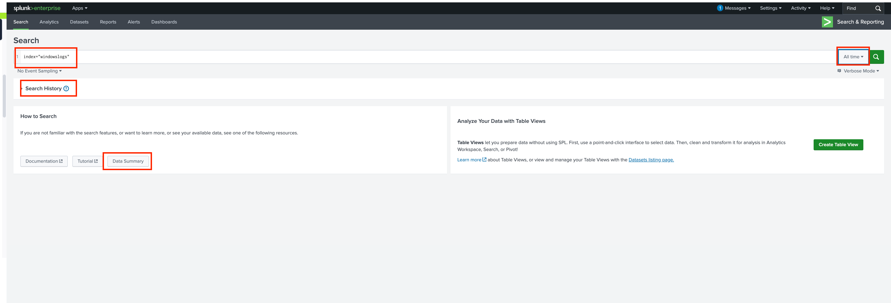
*Splunk Enterprise home page — entry point for all search, dashboard, and alert operations*

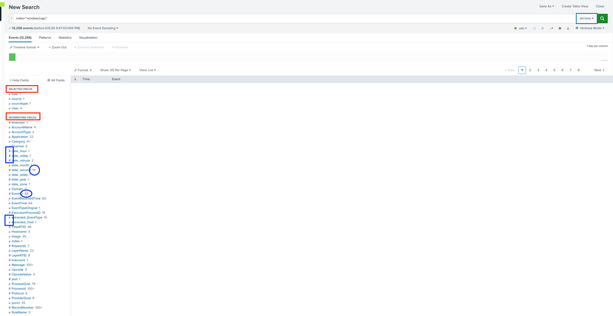
*Search & Reporting interface — search bar, time picker, field sidebar, and results panel*

---

## SPL Commands Covered

`search` · `fields` · `table` · `top` · `stats` · `sort` · `reverse` · `dedup` · `regex` · `eval` · `iplocation` · `lookup` · `transaction` · `makemv` · `anomalydetection`

---

## Lab Walkthrough

---

### 1. Basic Search — Establishing Total Event Count

**Objective:** Understand the dataset size and identify the most active source IP.

**Query:**
```spl
index=main
```

Running a bare index search with no filters returns all events. The result count gives the baseline for the entire dataset.


*12,256 total events in the main index — baseline established*

**Answer:** Total events = **12,256**

After submitting the first query, the **Fields sidebar** on the left populates with all extracted fields. Clicking `source.ip` reveals the top values by occurrence count.


*Fields sidebar showing top SourceIP values — 172.90.12.11 dominates*

**Answer:** SourceIP with most events = **172.90.12.11**

> 💡 **What this means in a SOC context:** A single source IP accounting for the largest share of events is a triage signal — it could be a noisy legitimate host, a misconfigured service, or an attacker. The next step in a real investigation would be to pivot on that IP and examine what event types it's generating.

---

### 2. Time-Based Filtering — Scoping to a Specific Window

**Objective:** Filter events to a precise one-minute window using the time picker.

**Query:**
```spl
index=main earliest="04/15/2022:08:05:00" latest="04/15/2022:08:06:00"
```

Time scoping is fundamental in SOC investigations. Searching "all time" on a production system with billions of events is unusable — every hunt starts with a time window.

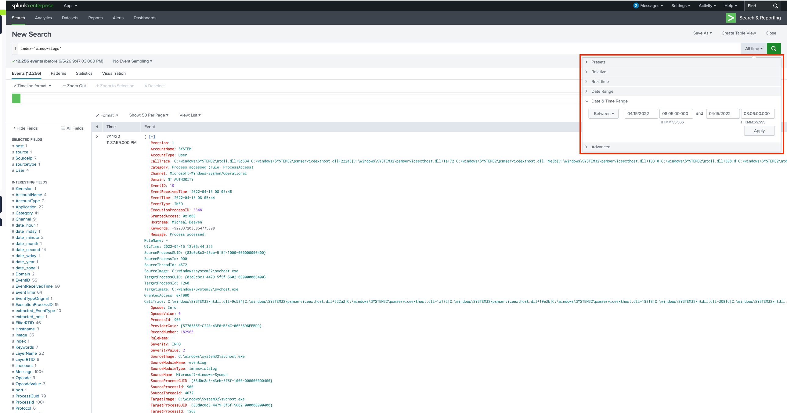
*Time picker scoped to 08:05–08:06 AM on April 15, 2022 — only matching events shown*

> 💡 **SPL time syntax:** `earliest` and `latest` accept both relative (`-1h`, `-24h`) and absolute (`MM/DD/YYYY:HH:MM:SS`) formats. In alerts and scheduled reports where you cannot use the UI picker, always set these in the query itself.

---

### 3. Field-Value Filter — Querying by Event ID

**Objective:** Count logon success events (EventID 4624) in the Windows Security log.

**Query:**
```spl
index=windowslogs EventID=4624
```

Windows Event ID 4624 is generated every time an account successfully logs on. Filtering to just this event type isolates authentication activity from the broader log stream.

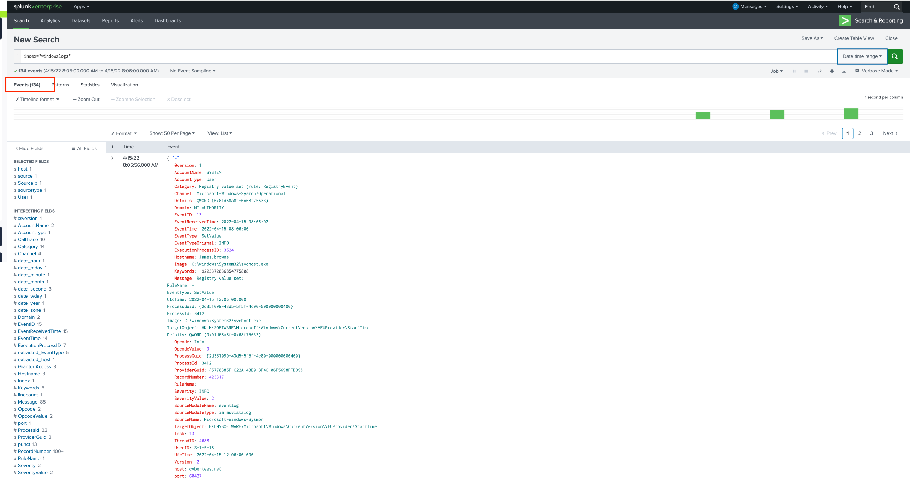
*26 events with EventID=4624 — all successful logon records*

**Answer:** Events with EventID=4624 = **26**

> 💡 **Key Windows Security Event IDs for SOC analysts:**
> - `4624` — Successful logon
> - `4625` — Failed logon (brute force indicator when in high volume)
> - `4648` — Logon with explicit credentials (pass-the-hash indicator)
> - `4768/4769` — Kerberos ticket events (Kerberoasting indicators)
> - `1102` — Security log cleared (anti-forensics indicator)

---

### 4. Multiple Field Conditions — Network Connection Filtering

**Objective:** Find events matching a specific destination IP and port combination.

**Query:**
```spl
index=windowslogs DestinationIp=172.18.39.6 DestinationPort=135
```

In SPL, multiple field conditions are joined by an implicit `AND` — every condition must be true for an event to match. Port 135 is the Microsoft RPC endpoint mapper — connections to this port from unexpected sources can indicate lateral movement attempts.


*4 events match the specific destination IP and port combination*

**Answer:** Events with DestinationIp=172.18.39.6 AND DestinationPort=135 = **4**

---

### 5. Compound Query — Correlating Hostname with Network Destination

**Objective:** Identify which source IP generates the most traffic from a specific host to a specific destination.

**Query:**
```spl
index=windowslogs Hostname=Salena.Adam DestinationIp=172.18.38.5
```

Chaining three field conditions narrows the search to a very specific context — traffic originating from one named host going to one specific destination. The `stats count by SourceIp` (visible in the field sidebar) then ranks the source IPs by volume.

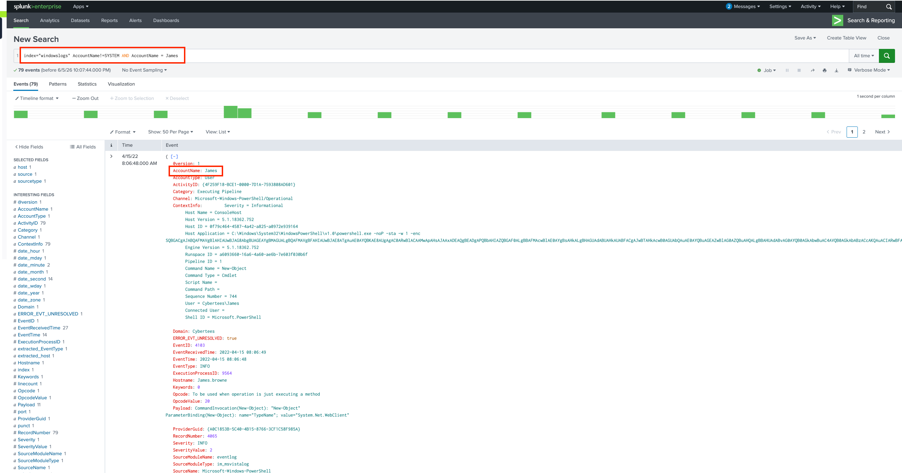
*Query scoped to Salena.Adam's host — SourceIp 172.90.12.11 returns the highest count*

**Answer:** Highest count SourceIp = **172.90.12.11**

> 💡 **Investigative pivot:** The same IP (172.90.12.11) appears as the top source in multiple queries. In a real investigation, this is the moment to pivot — open a new search scoped to that IP and examine every event type it generates across all indexes.

---

### 6. Wildcard Search

**Objective:** Test how Splunk's wildcard operator works against the full dataset.

**Query:**
```spl
index=main cyber*
```

The asterisk (`*`) is Splunk's wildcard — it matches zero or more characters following the prefix. `cyber*` matches `cyber`, `cybersecurity`, `cybermini`, or any other string beginning with "cyber". In this dataset it returns the full 12,256 events — meaning the term "cyber" or a derivative appears in every event.

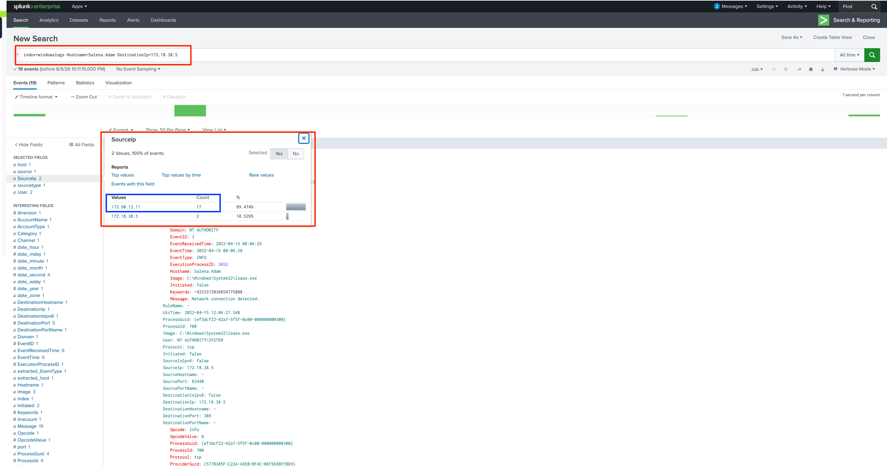
*cyber* matches 12,256 events — all records contain this term*

**Answer:** Events returned = **12,256**

---

### 7. Boolean Operators and Search Priority

**Objective:** Understand the precedence of AND, OR, and NOT in SPL search expressions.

**Query structure:**
```spl
index=main term1 AND term2
index=main term1 OR term2
index=main term1 NOT term2
```

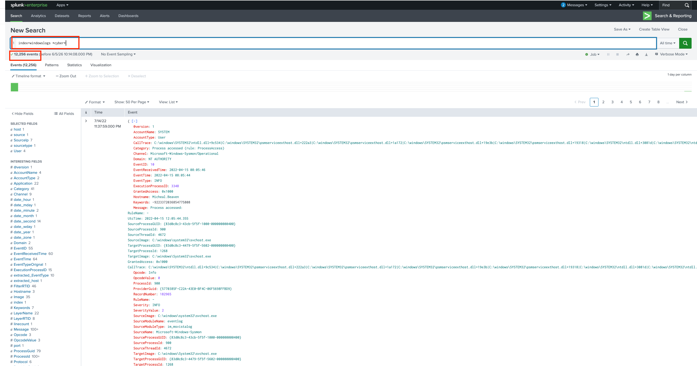
*Boolean operator behaviour in Splunk search — AND, OR, NOT demonstrated*

SPL evaluates boolean operators in this priority order (highest to lowest):

| Priority | Operator | Behaviour |
|----------|----------|-----------|
| 1 (Highest) | `NOT` | Excludes matching events |
| 2 | `AND` | Both conditions must match (also the default when no operator is written) |
| 3 (Lowest) | `OR` | Either condition can match |

**Answer:** Lowest priority operator = **OR**

> 💡 **Practical note:** Because AND is the implicit default, `index=main EventID=4624 SourceIp=172.90.12.11` and `index=main EventID=4624 AND SourceIp=172.90.12.11` produce identical results. Always use explicit parentheses when combining AND and OR to avoid unexpected behaviour: `(EventID=4624 OR EventID=4625) AND SourceIp=172.90.12.11`.

---

### 8. `fields` Command — Selecting Specific Fields

**Objective:** Display only Domain, SourceProcessId, and TargetProcessId, and identify the highest SourceProcessId value.

**Query:**
```spl
index=windowslogs | fields Domain SourceProcessId TargetProcessId
```

The `fields` command does two things: it makes results cleaner by showing only the columns you specify, and it speeds up queries by telling Splunk to skip extracting all other fields. On large datasets this can significantly reduce search time.


*Results narrowed to three fields — SourceProcessId column visible with values*

**Answer:** Highest SourceProcessId = **9496**

> 💡 **Performance tip:** `| fields field1 field2` keeps only the listed fields (inclusive). `| fields - _raw punct` removes specific fields (exclusive). When running expensive searches over millions of events, using `fields` early in the pipeline dramatically cuts processing time — Splunk skips extracting the excluded fields entirely.

---

### 9. `regex` Command — Pattern Matching on Field Values

**Objective:** Filter events where the TargetObject field ends with the word "Manager".

**Query:**
```spl
index=windowslogs | regex TargetObject="Manager$"
```

The `$` anchor in regex means "end of string" — so `Manager$` matches any TargetObject value that ends exactly with "Manager", regardless of what precedes it. This is useful when you need more precise matching than wildcards allow.

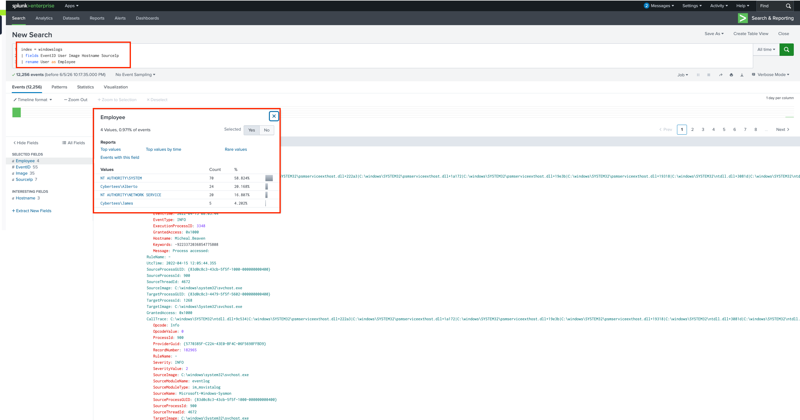
*Events where TargetObject ends with "Manager" — the field value with the highest count visible*

> 💡 **`regex` vs `where like()`:** Both filter by pattern, but `regex` uses full regular expression syntax (anchors, character classes, quantifiers) while `where like(field, "pattern%")` uses simpler SQL-style wildcards. Use `regex` when you need anchors (`^`, `$`) or character classes (`[a-z]`, `\d`).

---

### 10. `table` Command — Structured Output for Investigation

**Objective:** Build a clean table of EventID, AccountName, and AccountType fields.

**Query:**
```spl
index=windowslogs | table EventID AccountName AccountType
```

The `table` command produces a structured, column-based view — essential when reviewing many events during an investigation or preparing data for a report. Events are returned in reverse chronological order by default (most recent first).

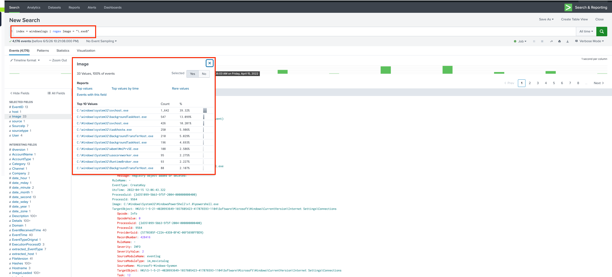
*Tabular view of EventID, AccountName, and AccountType — SYSTEM appears at the top*

**Answer:** First AccountName in results = **SYSTEM**

---

### 11. `reverse` Command — Flipping the Timeline

**Objective:** Reverse the event order to show oldest events first, then identify the first EventID.

**Query:**
```spl
index=windowslogs | table EventID AccountName AccountType | reverse
```

By default Splunk returns events newest-first. The `reverse` command flips this — oldest events appear at the top. This is critical when reconstructing an attack timeline: you need to see what happened first, not last.

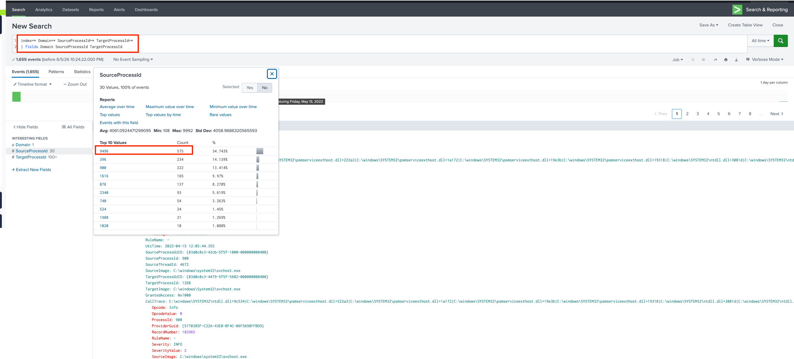
*After reverse — oldest event now appears first, EventID 800 is the first entry*

**Answer:** First EventID after reverse = **800**

> 💡 **Timeline reconstruction:** In a real incident, `reverse` is used constantly. Pattern: `index=windowslogs host=WKSTN-1 | table _time EventID AccountName CommandLine | reverse` gives you a chronological activity log for a specific host — equivalent to reading a journal of what happened on that machine from the beginning.

---

### 12. `reverse` on Process Timeline — Uncovering Account Activity

**Objective:** Build a reverse-chronological process execution timeline to identify credential usage.

**Query:**
```spl
index=windowslogs EventID=1
| table _time ParentProcessId ProcessId ParentCommandLine CommandLine
| reverse
```

EventID 1 (Sysmon Process Create) captures every process that started, including the full command line. Sorting oldest-first reveals the initial execution chain — including any credentials passed as command-line arguments, which attackers sometimes do (poorly) when automating account creation or password changes.


*Process timeline in chronological order — CommandLine column reveals the password set for user A1berto*

> 💡 **Why command-line logging matters:** Without Sysmon EventID 1 logging, you only know a process existed. With it, you see the full command including arguments — passwords, download URLs, encoded payloads. This is why Sysmon is considered mandatory telemetry in any mature SOC environment.

---

### 13. `top` Command — Frequency Analysis

**Objective:** Identify the most commonly executed process (Image field) across all Windows events.

**Query:**
```spl
index=windowslogs | top Image
```

`top` is a shorthand aggregation command that automatically counts occurrences of each unique value and returns results sorted highest-to-lowest, including a percentage column. It's the fastest way to answer "what's most common?" questions.


*top Image — C:\windows\system32\svchost.exe dominates with the highest count*

**Answer:** Most executed Image = **C:\windows\system32\svchost.exe**

> 💡 **Threat hunting with `top`:** In a real environment, run `| top limit=20 Image` and scan for anything unexpected. `svchost.exe`, `explorer.exe`, and `chrome.exe` at the top are normal. `installer.exe`, `mimikatz.exe`, or executables from `\Temp\` near the top are immediate red flags. The `top` command turns frequency analysis into a 5-second task.

---

### 14. `iplocation` Command — Geographic Enrichment

**Objective:** Enrich source IP addresses with geographic data and identify the originating region.

**Query:**
```spl
index=windowslogs | iplocation SourceIp
```

`iplocation` performs a MaxMind GeoIP lookup on any IP field and automatically adds new fields: `City`, `Country`, `Region`, `lat`, `lon`. No external lookup file needed — it's built into Splunk. The enriched data can then be used for geographic filtering, choropleth maps, or anomaly detection.


*iplocation enriches source IPs with geographic data — Region field shows California*

**Answer:** Region = **California**

> 💡 **Impossible travel detection:** `iplocation` is the foundation of impossible travel alerts — finding a user who authenticates from New York and then Tokyo within 30 minutes. Combined with `stats earliest(_time) as first, latest(_time) as last by user, Country`, you can surface these in one query.

---

### 15. `lookup` Command — Risk Score Enrichment

**Objective:** Enrich process names with risk scores from a custom lookup table and identify the highest-risk image.

**Query:**
```spl
index=windowslogs
| lookup image_riskscore Image OUTPUT RiskScore
| stats count by Image RiskScore
| sort - RiskScore
```

Lookups join search results with external reference data (CSV files). Here, `image_riskscore` is a lookup table that maps known process image paths to associated risk scores. The `OUTPUT` keyword specifies which columns to pull from the lookup into the results.


*Lookup enrichment — Image field joined with risk scores, sorted descending to reveal highest-risk process*

> 💡 **Custom lookup tables in SOC:** Threat intelligence teams maintain lookup tables for: known-malicious IPs, high-risk process names, whitelisted service account names, asset classification (server vs workstation), and more. These turn raw log data into context-enriched, actionable alerts without writing complex SPL every time.

---

### 16. Anomaly Detection — Identifying Outlier Users in VPN Logs

**Objective:** Use statistical anomaly detection on VPN login data to surface unusual authentication behaviour.

**Query 1:**
```spl
index=vpnlogs
| iplocation SourceIp
| stats count by user, Country
| anomalydetection
```

`anomalydetection` applies statistical modelling to flag rows whose values are significantly different from the expected distribution. In VPN logs, a user suddenly logging in from an unexpected country is a classic insider threat or credential compromise indicator.

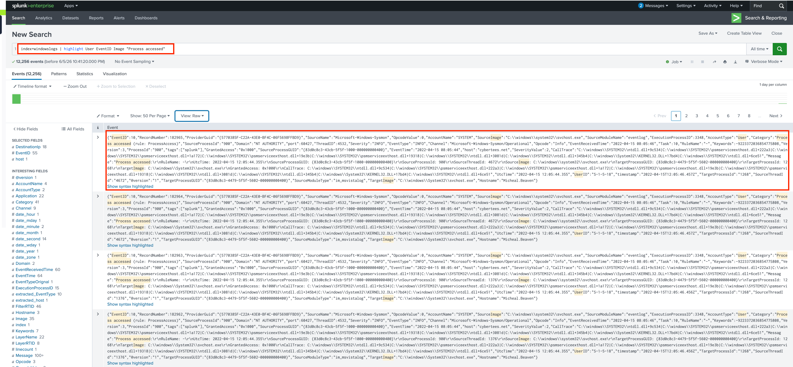
*First anomaly detection query on VPN logs — outlier users flagged by the anomalydetection command*


*jsmith flagged as an outlier — login pattern deviates significantly from their baseline*

**Answer:** Other outlier user = **jsmith**

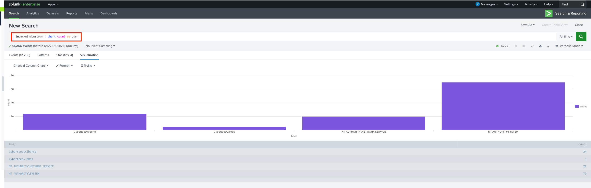
*Geographic anomaly — the outlier user's login originated from Japan (JP)*

**Answer:** Anomalous country = **JP**

> 💡 **What `anomalydetection` does:** It calculates the expected probability of each data point given the overall distribution, then flags those whose probability falls below a threshold as anomalies. For VPN logins, if a user always logs in from the US and suddenly appears from Japan, the statistical probability of that combination is very low — and the command surfaces it automatically without needing manual thresholds.

---

### 17. Anomaly Detection — Detecting Off-Hours Authentication

**Objective:** Detect users logging into VPN at unusual hours (specifically 3 AM).

**Query 2:**
```spl
index=vpnlogs
| eval hour=strftime(_time, "%H")
| stats count by user, hour
| anomalydetection
```

Extracting the hour from the timestamp and running anomaly detection on the `user + hour` combination identifies accounts that authenticate at statistically unusual times. A 3 AM login from an account that has never been seen outside business hours is a strong indicator of compromise.


*Second anomaly detection query — time-based analysis of VPN logins*


*User flagged for suspicious 3 AM login — visible in the hour-based anomaly results*

> 💡 **Time-based anomaly detection in practice:** The combination of `strftime(_time, "%H")` to extract the hour, `stats count by user, hour`, and `anomalydetection` is a production-ready pattern. In a real SIEM, this runs as a scheduled search every 6 hours. Any account with a statistically anomalous login hour gets added to a risk score — accumulate enough risk and an alert fires automatically.

---

### 18. `dedup` Command — Removing Duplicate Events

**Objective:** Deduplicate events to get one record per unique field combination.

**Query:**
```spl
index=windowslogs | dedup EventID AccountName
```

`dedup` keeps only the first occurrence of each unique value (or combination of values) and discards the rest. Useful for building distinct user lists, unique IP inventories, or clean summary tables where repeated rows add noise.


*dedup removes duplicate EventID+AccountName combinations — one row per unique pair*

> 💡 **`dedup` vs `stats dc()`:** Use `dedup` when you want to keep the full event fields for unique records (for further pipeline processing). Use `stats dc(field)` when you just need a count of distinct values. They answer different questions.

---

### 19. `transaction` Command — Grouping Related Events Into Sessions

**Objective:** Group related events into logical sessions using a common field.

**Query:**
```spl
index=windowslogs
| transaction AccountName maxspan=5m
| table AccountName eventcount duration _time
```

`transaction` groups consecutive events sharing the same field value into a single result, adding `eventcount` (how many events were grouped) and `duration` (time from first to last event in seconds). This is how you build session-level analysis — treating a series of logon/activity/logoff events as one cohesive unit.

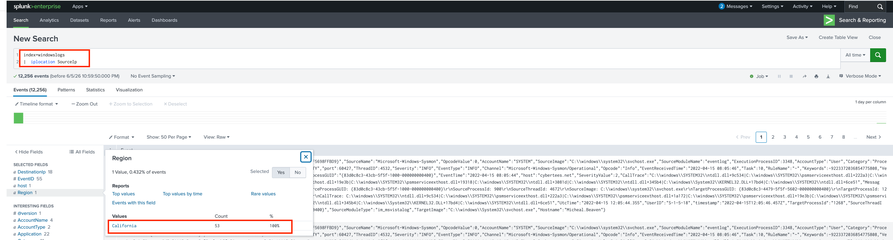
*Events grouped into sessions by AccountName — eventcount and duration fields added automatically*

> 💡 **When to use `transaction`:** Use it for session reconstruction (login → activity → logout), HTTP request grouping (all requests in one browser session), or multi-step attack chain analysis. For simple statistics, prefer `stats earliest/latest by field` — it's 10–100x faster on large datasets.

---

### 20. `makemv` Command — Splitting Multi-Value Fields

**Objective:** Expand a delimited field into multiple values for individual analysis.

**Query:**
```spl
index=windowslogs | makemv delim="," CommandLine
| mvexpand CommandLine
```

`makemv` splits a single-value string field into a multi-value field using a delimiter. Combined with `mvexpand`, each value becomes its own event row — making it possible to `stats count by` individual values that were originally concatenated.

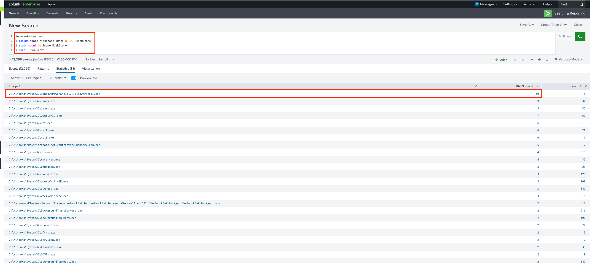
*makemv splits delimited CommandLine values — each argument becomes individually searchable*

---

## Key Findings Summary

| Query | Result |
|-------|--------|
| Total events in index=main | **12,256** |
| Most active SourceIP | **172.90.12.11** |
| Events with EventID=4624 (Logon Success) | **26** |
| Events: DestinationIp=172.18.39.6, Port=135 | **4** |
| Top SourceIp for Hostname=Salena.Adam | **172.90.12.11** |
| Wildcard search `cyber*` event count | **12,256** |
| Lowest priority boolean operator | **OR** |
| Highest SourceProcessId (via fields command) | **9,496** |
| First AccountName in table output | **SYSTEM** |
| First EventID after reverse | **800** |
| Most executed process (top Image) | **C:\windows\system32\svchost.exe** |
| iplocation Region of source IPs | **California** |
| VPN anomaly outlier user | **jsmith** |
| Anomalous login country for outlier | **JP (Japan)** |

---

## SPL Command Reference

| Command | Purpose | Example |
|---------|---------|---------|
| `fields` | Select or exclude specific fields | `\| fields EventID AccountName` |
| `table` | Display results as a formatted table | `\| table _time user src_ip` |
| `top` | Top N values by frequency | `\| top limit=10 Image` |
| `stats` | Aggregate statistics | `\| stats count by user` |
| `sort` | Order results | `\| sort - count` |
| `reverse` | Flip result order | `\| reverse` |
| `dedup` | Remove duplicate rows | `\| dedup AccountName` |
| `regex` | Filter by regex pattern | `\| regex field="pattern$"` |
| `eval` | Create or transform fields | `\| eval hour=strftime(_time,"%H")` |
| `iplocation` | GeoIP enrichment | `\| iplocation SourceIp` |
| `lookup` | Join with reference table | `\| lookup table key OUTPUT field` |
| `transaction` | Group events into sessions | `\| transaction user maxspan=5m` |
| `makemv` | Split delimited field into multiple values | `\| makemv delim="," field` |
| `anomalydetection` | Statistical outlier detection | `\| anomalydetection` |

---

## What I Learned

**1. SPL is a pipeline language — order matters.** Every `|` passes transformed data to the next command. A `stats` command mid-pipeline collapses thousands of events into summary rows — any command after it works on that summary, not the original events. Getting this mental model right unlocks the full power of SPL.

**2. The Fields sidebar is an investigation accelerator.** After every query, the sidebar shows the top 10 values for every extracted field. In a live investigation, clicking a field value adds it as a filter instantly — no typing required. This is the fastest way to pivot from "something is suspicious" to "here is exactly what is suspicious."

**3. `iplocation` + `anomalydetection` is a complete geo-based detection pattern.** Two commands, one pipeline, and you have impossible travel detection or off-hours login detection running. These are production-level detection capabilities that took me one query to build.

**4. Time scoping is non-negotiable in production.** An unscoped `index=main` query on a real Splunk deployment with billions of events would timeout or take minutes. Every investigation starts with `earliest=` and `latest=` — even a rough 24-hour window is better than none.

**5. `lookup` tables turn Splunk from a log aggregator into a threat intelligence platform.** Joining process names to risk scores, IPs to threat feeds, or usernames to HR data all happen through the same `| lookup` pattern. The power of the detection scales with the quality of the lookup data behind it.

**6. Command-line argument logging (Sysmon EventID 1) is critical.** The A1berto query demonstrated how attacker mistakes — like passing passwords in command-line arguments — are only visible if process creation logging captures the full command line. Without Sysmon, that evidence simply does not exist.

---

## References

- [Splunk SPL Documentation](https://docs.splunk.com/Documentation/Splunk/latest/SearchReference/Whatsinthismanual)
- [Sysmon Event ID Reference](https://learn.microsoft.com/en-us/sysinternals/downloads/sysmon)
- [Windows Security Event IDs](https://www.ultimatewindowssecurity.com/securitylog/encyclopedia/)
- [SwiftOnSecurity Sysmon Config](https://github.com/SwiftOnSecurity/sysmon-config)
- [Next in Series → SOC Dashboards & Alerting](../02-SOC-Dashboards-Alerting/) *(coming soon)*

---

*Part of the [Splunk Security Monitoring](../) series by [Yamini Savalia](https://cybermini.com)*
