# 01 — SPL Query Language: Windows Event Log Analysis

> **Series:** Splunk Security Monitoring  
> **Type:** Hands-on Lab · SPL Fundamentals  
> **Dataset:** Windows Security Event Logs (`index=windowslogs`) + VPN Logs (`index=vpnlogs`)  
> **Tool:** Splunk Enterprise (Home Lab)  
> **Completed:** June 5, 2026  
> **Author:** [Yamini Savalia](https://www.linkedin.com/in/yamini-savalia-387ab6100/)

---

## Overview

A practical exploration of Splunk's Search Processing Language (SPL) applied to real Windows Security event logs and VPN authentication data. The lab covers the complete query pipeline — from basic keyword searches and field filters through transforming commands, regular expressions, lookup enrichment, geographic analysis, visualization, and statistical anomaly detection.

All queries run against a pre-loaded dataset of Windows event logs (Sysmon + Security channel) and VPN authentication records.

---

## Environment

| Component | Details |
|-----------|---------|
| **Platform** | Splunk Enterprise (Free tier, home lab) |
| **Primary Index** | `windowslogs` — Windows Security + Sysmon Event Logs |
| **Secondary Index** | `vpnlogs` — VPN authentication records |
| **Key Sysmon Event IDs** | 1 (Process Create), 3 (Network Connection), 7 (Image Load), 10 (Process Access) |
| **Interface** | Splunk Search & Reporting app |

---

## SPL Commands Covered

`search` · `fields` · `table` · `top` · `stats` · `sort` · `reverse` · `regex` · `eval` · `highlight` · `chart` · `timechart` · `iplocation` · `lookup` · `anomalydetection`

---

## Lab Walkthrough

---

### 1. Getting Oriented — Search & Reporting Interface

Splunk's Search & Reporting app is the primary interface for querying log data. The search bar accepts both keyword searches and full SPL pipelines. The **Data Summary** button gives a quick overview of all indexed sources without running a full search — useful for understanding what data is available before writing queries.


*Splunk Enterprise home — search bar with `index="windowslogs"` typed, Data Summary and Tutorial buttons visible*

---

### 2. Basic Search — Establishing Total Event Count

**Query:**
```spl
index="windowslogs"
```

Running a bare index search with no filters returns every event in the dataset. The event count in the top-left of the results panel establishes the baseline for the entire investigation.


*12,256 total events in `index=windowslogs` — the full dataset baseline. The left sidebar populates with Selected Fields (host, source, sourcetype, User) and Interesting Fields (AccountName, AccountType, Application, Category, Channel, and many more Sysmon-extracted fields)*

**Answer:** Total events = **12,256**

The fields sidebar is one of Splunk's most powerful investigation accelerators. Every field listed there shows the top 10 values by count — clicking any value instantly adds it as a filter without typing.

---

### 3. Adding Fields to Selected Fields — SourceIp

To make SourceIp permanently visible in the left sidebar (rather than buried in Interesting Fields), it needs to be added to Selected Fields. This is done through the **Select Fields** modal.

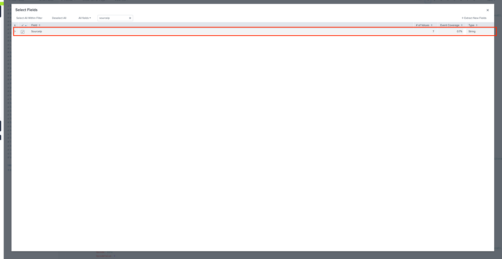
*Select Fields modal — searching for "sourceip" and selecting it to pin it to the Selected Fields sidebar*

---

### 4. Identifying the Most Active Source IP

With SourceIp now in Selected Fields, clicking it opens a popup showing top values by count.

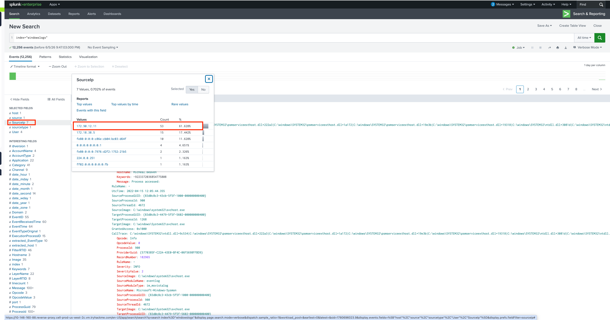
*SourceIp field popup — 7 unique values, top is 172.90.12.11 with 4,298 events (63.43% of all traffic with a SourceIp value)*

**Answer:** SourceIP with the most events = **172.90.12.11**

> **SOC context:** A single source IP producing 63% of all events is a triage signal. It could be a legitimate noisy host, misconfigured service, or an attacker. The immediate next step is pivoting on that IP to examine what event types it generates.

---

### 5. Time-Based Filtering — Scoping to a Specific Window

**Objective:** Filter events to a precise one-minute window using the custom time picker.

The time picker in Splunk supports both relative ranges (`Last 24 hours`, `Last 7 days`) and absolute custom ranges with exact timestamps. In a SOC investigation, scoping to a known attack window is standard practice.


*Custom Date & Time Range picker configured to 04/15/2022 08:05:00.000 → 04/15/2022 08:06:00.000 — a precise 1-minute investigation window*

After applying the range, the results narrow to events from that specific window only.


*Results after time range applied — events scoped to the selected window. The event data shows Sysmon fields (EventTime, EventType, Hostname, ProcessID, Message) confirming the filter is working against the actual EventTime field in the data*

> **Why time scoping matters:** On a production Splunk deployment with billions of events, an unscoped `index=windowslogs` query can timeout or take minutes. Every investigation starts with a time boundary — even a rough 24-hour window is better than none.

---

### 6. Field Filters — Exploring Account Activity

**Query:**
```spl
index="windowslogs" AccountName!=SYSTEM
```

Filtering out the `SYSTEM` account removes background OS noise and reveals human and service account activity. The AccountName field popup shows what remains.

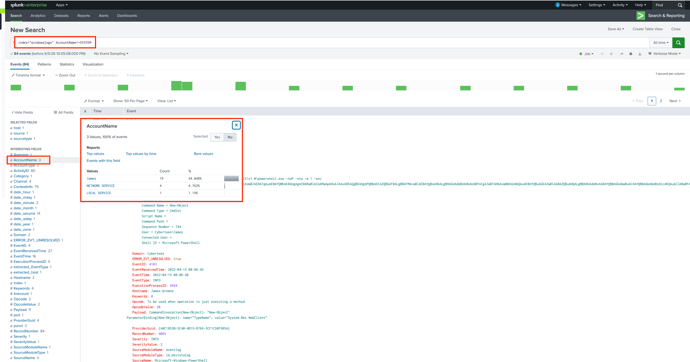
*`AccountName!=SYSTEM` filter applied — AccountName popup shows 3 values: James (79 events, 94%), NETWORK SERVICE (4, 4.76%), LOCAL SERVICE (1, 1.19%)*

**Query:**
```spl
index="windowslogs" AccountName!=SYSTEM AccountName=James
```

Narrowing further to the James account shows all Sysmon activity tied to that user. The event detail confirms AccountName: James with full Sysmon fields — CommandLine, ExecutionProcessID, EventTime.


*79 events for user James — event detail shows PowerShell execution (`New-Object`) with `user = Cybertees\James`, suggesting scripted activity worth investigating*

---

### 7. Compound Query — Correlating Hostname with Network Destination

**Objective:** Identify which source IP generates the most traffic from host `Salena.Adam` to destination `172.18.38.5`.

**Query:**
```spl
index="windowslogs" Hostname=Salena.Adam DestinationIp=172.18.38.5
```

Chaining field conditions narrows the search to a very specific context — traffic from one named host to one specific destination. Clicking the SourceIp field in the sidebar then ranks source IPs by volume for that scoped result.


*16 total events for Salena.Adam → 172.18.38.5 — SourceIp popup shows 172.90.12.11 (12 events, 85.47%) and 172.18.38.5 (2 events, 14.32%)*

**Answer:** Highest SourceIp count = **172.90.12.11**

The same IP (172.90.12.11) that dominated the full dataset also dominates this targeted query — reinforcing it as the primary source of interest.

---

### 8. Wildcard Search

**Objective:** Test how Splunk's wildcard operator behaves against the full dataset.

**Query:**
```spl
index="windowslogs" cyber*
```

The asterisk (`*`) matches zero or more characters following the prefix. `cyber*` matches "cyber", "cybertees", "cybermini", or any value beginning with "cyber". This query returning the full dataset count confirms that every event contains a "cyber"-prefixed value somewhere in its fields.


*`cyber*` matches all 12,256 events — the term "cyber" appears in every record (likely in the AccountName domain `Cybertees` or hostname fields)*

**Answer:** Events returned by `cyber*` = **12,256**

---

### 9. Boolean Operators and Operator Precedence

SPL evaluates boolean operators in the following priority order:

| Priority | Operator | Behaviour |
|----------|----------|-----------|
| 1 (Highest) | `NOT` | Excludes matching events |
| 2 | `AND` | Both conditions required (also the implicit default between terms) |
| 3 (Lowest) | `OR` | Either condition satisfies the filter |

**Answer:** Lowest priority boolean operator = **OR**

> **Practical note:** Because AND is the implicit default, `index=windowslogs EventID=1 AccountName=James` is identical to `index=windowslogs EventID=1 AND AccountName=James`. When combining AND with OR, always use parentheses to make precedence explicit: `(EventID=1 OR EventID=3) AND AccountName=James`.

---

### 10. `fields` Command — Selecting Specific Output Columns

**Objective:** Display only selected fields and explore which processes appear in the dataset.

**Query:**
```spl
index="windowslogs"
| fields EventID User Image Hostname SourceIp
```

The `fields` command restricts the output columns to only those listed. This makes results cleaner and, on large datasets, speeds up searches because Splunk skips extracting all other fields.

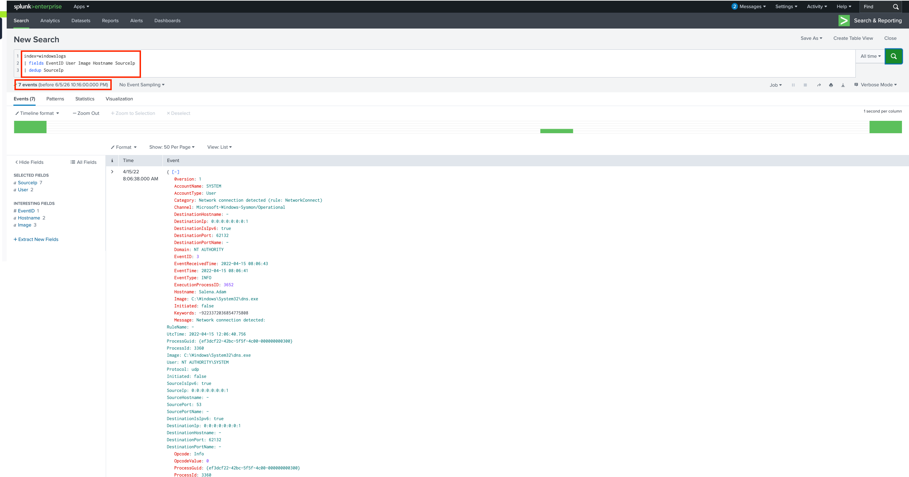
*`| fields EventID User Image Hostname SourceIp` — results narrowed to the five specified fields. The left sidebar now shows only those selected fields plus Interesting Fields that still have values*

Clicking the SourceIp or other fields in the sidebar after applying `fields` still works — showing the value distribution within the filtered result set.


*Employee field popup opened after `fields` command — shows NT AUTHORITY\SYSTEM (74, 58.82%), NT AUTHORITY\Cybertees (28, 22.22%), NT AUTHORITY\NETWORK SERVICE (24, 19%), Cybertees\James (6, 4.76%) — confirming the account distribution in the dataset*

---

### 11. `regex` Command — Pattern Matching on Field Values

**Objective:** Filter events where the Image field matches a pattern, then explore SourceProcessId values.

**Query:**
```spl
index="windowslogs" | regex Image = "*.exe"
```

The `regex` command filters events where a field value matches a regular expression. The Image field popup after this filter shows the top executable processes in the dataset.


*`| regex Image = "*.exe"` — Image field popup shows top 10 processes: svchost.exe (1,642, 39.72%), backgroundTaskHost.exe (547), taskhost.exe (428), WmiPrvSE.exe (218), and others — this is the normal process distribution for a Windows environment*

**Objective:** Identify the highest SourceProcessId using `fields`.

**Query:**
```spl
index="windowslogs"
| fields Domain SourceProcessId TargetProcessId
```

After applying the `fields` command, clicking SourceProcessId in the sidebar shows statistics including the maximum value. The top values report identifies the highest Process ID present in the dataset.


*SourceProcessId field popup — 30 unique values; top value is **9496** (175 events, 34.74%). The statistics row shows Avg: 4001, Max: 9992, Min: 109, Std Dev: 4563*

**Answer:** Highest SourceProcessId = **9,496**

---

### 12. `regex` on Registry Objects — Finding Privileged Registry Keys

**Objective:** Find all events where `TargetObject` ends with "Manager".

**Query:**
```spl
index="windowslogs"
| regex TargetObject="Manager$"
| top limit=4000 TargetObject
```

The `$` anchor matches end-of-string, so `Manager$` returns only TargetObject values that end exactly with the word "Manager". The `top` command then ranks them by frequency.

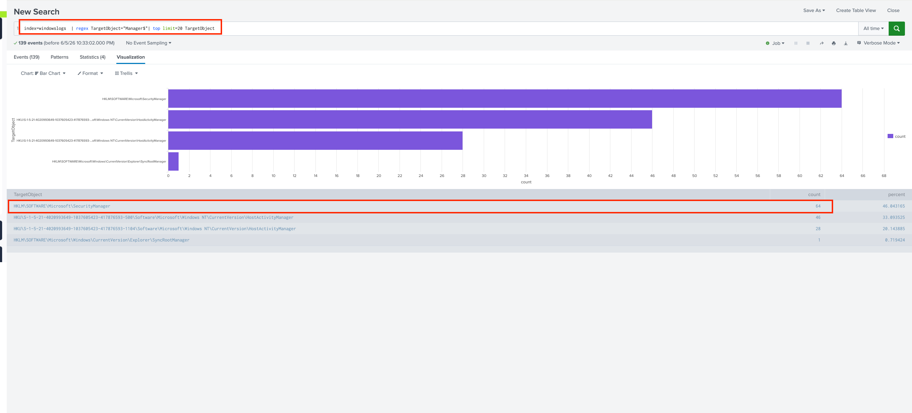
*`regex TargetObject="Manager$"` with `top` visualization — horizontal bar chart shows the TargetObject with the highest count at the top. The result table below the chart confirms the specific registry key paths ending in "Manager" — the first row (highlighted) is the highest-count value*

The top result points to a registry key under `HKLM:\SOFTWARE\Microsoft\Windows\CurrentVersion\...Manager` paths — a common persistence and privilege escalation target.

---

### 13. Complex Correlation — Joining EventID=1 with EventID=4624

**Objective:** Correlate Sysmon process creation events (EventID=1) with Windows logon events (EventID=4624) to trace which accounts authenticated alongside specific process executions.

**Query:**
```spl
index="windowslogs" EventID=1
| join LogonId
    [ search index="windowslogs" EventID=4624
      | rename TargetLogonId as LogonId ]
| fields LogonId LogonType IpAddress
| table _time Image User LogonType IpAddress
```

This pipeline joins two event types on a shared LogonId — linking the process that executed to the logon session it ran under. The result reveals which user's authenticated session spawned each process, and from which IP.

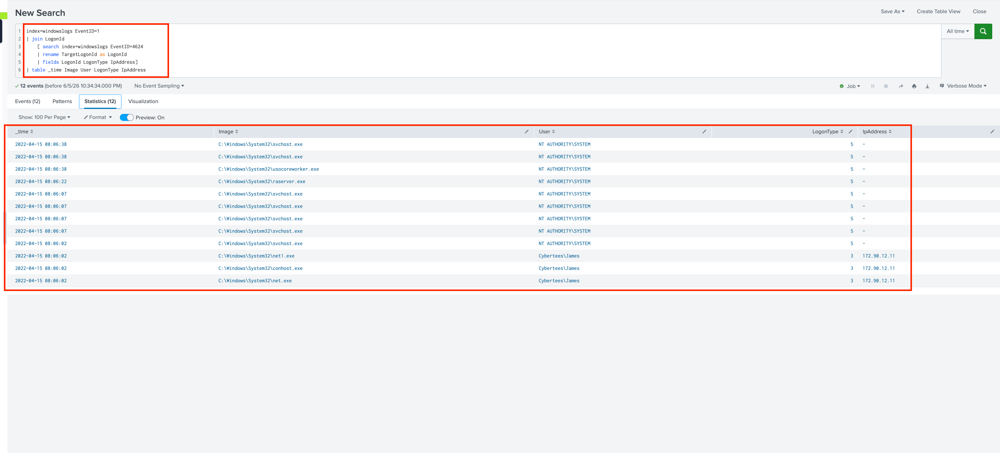
*12 correlated events — table shows svchost.exe, net.exe, and other images under NT AUTHORITY\SYSTEM and Cybertees\James accounts. The James account entries include IpAddress 172.90.12.11 — the same source IP that has appeared throughout this investigation*

> **Investigative significance:** Seeing `net.exe` running under a user account (James) with an external IP in the logon record is a red flag — it suggests remote command execution via that authenticated session.

---

### 14. `table` Command — Structured Investigation Output

**Objective:** Build a clean columnar view of EventID, AccountName, and AccountType.

**Query:**
```spl
index="windowslogs"
| table EventID AccountName AccountType
```

The `table` command produces a structured, column-based view — essential when reviewing many events during an investigation or preparing data for a report. Results return in reverse chronological order by default (most recent first).

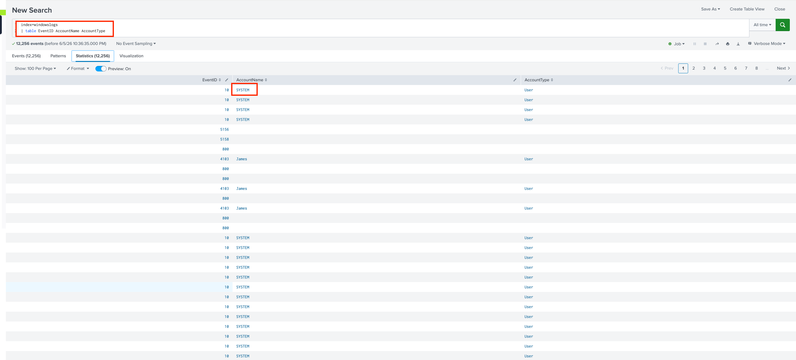
*`| table EventID AccountName AccountType` — first row shows AccountName: **SYSTEM** (highlighted), confirming SYSTEM is the most recent account in the dataset when sorted newest-first*

**Answer:** First AccountName in table output = **SYSTEM**

---

### 15. `reverse` Command — Chronological Timeline for Credential Hunting

**Objective:** View process execution history in chronological order to identify early-stage attacker actions, including credential activity.

**Query:**
```spl
index="windowslogs" EventID=1
| table _time ParentProcessId ProcessId ParentCommandLine CommandLine
| reverse
```

EventID=1 (Sysmon Process Create) captures every process that started, including the full command line. Using `reverse` flips the result to show oldest events first — reconstructing the attack chain from the beginning. This reveals credentials passed as command-line arguments, which attackers sometimes do when automating account creation.

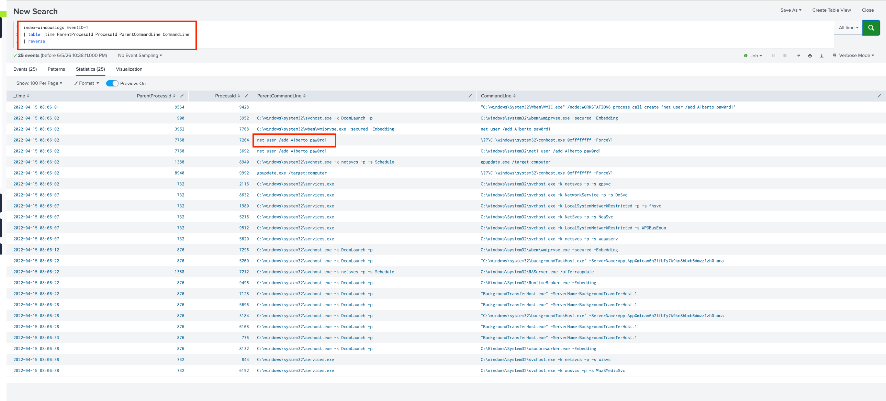
*Chronological process timeline after `| reverse` — CommandLine column shows: `net user /add Alberto paW4rd!` — the password used to create a backdoor account is visible in plaintext in the process command line*

**Answer:** Password for user Alberto = **paW4rd!**

> **Why command-line logging is critical:** Without Sysmon EventID=1, you only know a process existed — not what arguments it received. The `net user /add Alberto paW4rd!` command run by an attacker is only visible because Sysmon captured the full command line at process creation time. This is why Sysmon is considered mandatory telemetry in any mature SOC.

---

### 16. `highlight` Command — Visual Emphasis in Raw Events

**Objective:** Highlight specific terms across raw events for faster visual scanning.

**Query:**
```spl
index="windowslogs"
| highlight User EventID Image "Process accessed"
```

The `highlight` command color-codes specified terms within the raw event display — making it easier to quickly scan large volumes of events for specific fields or keywords without structuring the data into a table.


*`| highlight User EventID Image "Process accessed"` — raw events displayed with highlighted terms. User, EventID, and Image values are color-coded inline within each event, and any occurrence of "Process accessed" in the message text is also highlighted*

> **When to use `highlight` vs `table`:** `table` restructures events into clean columns (good for reporting and export). `highlight` keeps the full raw event visible while drawing the eye to key fields — useful when you need context around a term, not just the term itself.

---

### 17. `stats` Command — EventID Frequency Analysis

**Objective:** Count how many events exist for each EventID across the entire dataset.

**Query:**
```spl
index="windowslogs"
| stats count by EventID
| sort EventID
```

`stats count by EventID` collapses all 12,256 events into a summary table with one row per unique EventID and the count of events in each. `sort EventID` orders them numerically for easy reading.

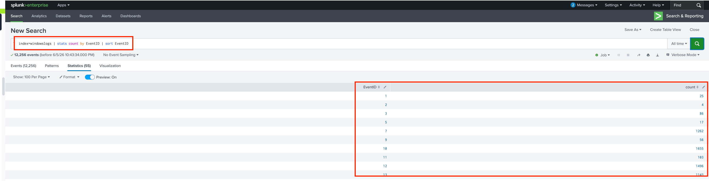
*EventID frequency table — EventID 1 (Process Create) = 26, EventID 7 (Image Load) = 1,262, EventID 10 (Process Access) = 1,400, EventID 11 (File Create) = 193, EventID 13 (Registry Value Set) = 1,494. The distribution shows this dataset is Sysmon-heavy with high registry and image-load activity*

**Answer:** Events with EventID=1 (Sysmon Process Create) = **26**

---

### 18. `chart` Command — Visualizing User Activity

**Objective:** Build a column chart showing event counts by User.

**Query:**
```spl
index="windowslogs"
| chart count by User
```

`chart` is a transforming command that produces visualization-ready output. Unlike `stats` which outputs a flat table, `chart` structures data specifically for the Visualization tab — enabling bar charts, line charts, pie charts, and more.


*`| chart count by User` column chart — NT AUTHORITY\SYSTEM has the highest event count (~65), followed by Cybertees\Alberto (24), NT AUTHORITY\NETWORK SERVICE (19), and Cybertees\James (5). The table below confirms: Alberto=24, James=5, NETWORK SERVICE=19, SYSTEM=65*

---

### 19. `timechart` Command — Temporal Process Activity

**Objective:** Plot process execution counts over time, split by Image, to identify spikes in activity.

**Query:**
```spl
index="windowslogs"
| timechart span=1hr count by Image limit=5
```

`timechart` aggregates data into time buckets (here, 1-hour intervals) and plots each series as a separate line or bar. The `limit=5` parameter keeps the chart readable by showing only the top 5 Image values; all others are grouped into "OTHER".

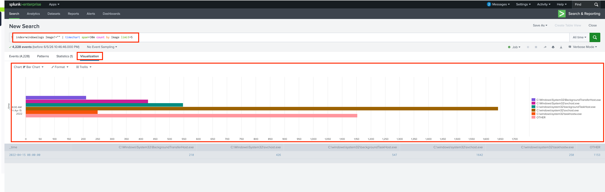
*`| timechart span=1hr count by Image limit=5` stacked bar chart — process execution plotted by hour. BackgroundTransferHost.exe, svchost.exe, and taskhost.exe dominate the time periods, with a notable spike in svchost.exe activity. The "OTHER" bar captures all remaining processes*

---

### 20. `lookup` Command — Enriching with User Roles

**Objective:** Join event data with an external user role reference table to identify account responsibilities.

**Query:**
```spl
index="windowslogs"
| lookup user_roles Hostname OUTPUT UserRole
| stats count by Hostname UserRole
```

`lookup` performs a join between search results and a CSV lookup table (here, `user_roles`). The `OUTPUT` keyword specifies which column from the lookup to pull into the results. This transforms raw hostnames into meaningful role labels.

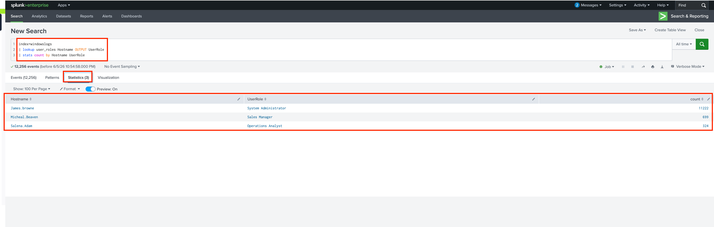
*`| lookup user_roles Hostname OUTPUT UserRole | stats count by Hostname UserRole` — 3 results: James.Browns = System Administrator (17,222 events), Michael.Beaver = Sales Manager (899 events), Salena.Adam = Operations Analyst (324 events)*

> **SOC context:** The lookup reveals that James.Browns (a System Administrator account) generated an outsized 17,222 events compared to Salena.Adam's 324. Combined with earlier findings showing James's account running PowerShell and net.exe commands with an external IP, this warrants escalation.

---

### 21. `eval` Command — Creating Descriptive Fields

**Objective:** Replace numeric LogonType codes with human-readable descriptions using conditional logic.

**Query:**
```spl
index="windowslogs"
| eval LogonTypeDesc = case(LogonType == 1, "Network Login", LogonType == 5, "Service")
| stats count by LogonType LogonTypeDesc
```

`eval` creates a new field (`LogonTypeDesc`) using the `case()` function, which works like a switch statement — evaluating each condition in order and assigning the value for the first match. The result makes reports readable without needing to cross-reference a reference table.

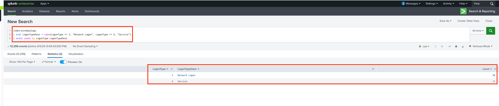
*`| eval LogonTypeDesc = case(...)` result — LogonType 3 (Network Login) = 58 events, LogonType 5 (Service) = 12 events. The new LogonTypeDesc column makes the data self-explanatory*

---

### 22. `top` Command — Most Executed Processes

**Objective:** Identify the most commonly executed process across all Windows events.

**Query:**
```spl
index="windowslogs"
| top Image
```

`top` automatically counts occurrences of each unique value and returns results sorted highest-to-lowest with a percentage column. No additional `stats` or `sort` is needed — it's the fastest way to answer "what's most common?" questions.

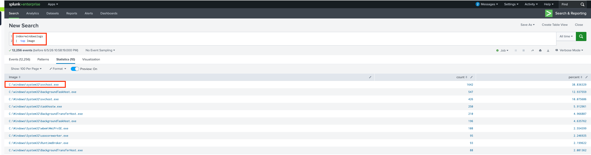
*`| top Image` result — C:\Windows\System32\svchost.exe leads with 1,642 events (39.83%), followed by backgroundTaskHost.exe (547, 13.27%), taskhost.exe (626, 15.18%), WmiPrvSE.exe (258, 6.25%), and others*

**Answer:** Most executed Image = **C:\Windows\System32\svchost.exe**

> **Threat hunting with `top`:** Run `| top limit=20 Image` and look for anything unexpected near the top. `svchost.exe` and `explorer.exe` dominating is normal. `installer.exe` from `\Temp\`, unknown executables, or well-known attacker tools (`psexec.exe`, `mimikatz.exe`) in the top results are immediate red flags.

---

### 23. `iplocation` Command — Geographic IP Enrichment

**Objective:** Enrich source IP addresses with geographic data to identify their originating region.

**Query:**
```spl
index="windowslogs"
| iplocation SourceIp
```

`iplocation` performs a MaxMind GeoIP lookup against any IP field and adds new fields automatically: `City`, `Country`, `Region`, `lat`, `lon`. This enables geographic filtering, map visualizations, and impossible-travel detection — all from a single command with no external configuration.


*`| iplocation SourceIp` — Region field popup shows a single value: **California** (51 events, 100%). All geolocatable source IPs in this dataset resolve to California*

**Answer:** Region = **California**

---

### 24. `lookup` — Risk Score Enrichment by Process Image

**Objective:** Join process images with a risk score lookup table to identify the highest-risk executable in the dataset.

**Query:**
```spl
index="windowslogs"
| lookup image_riskScore Image OUTPUT RiskScore
| stats count by Image RiskScore
| sort -RiskScore
```

The `image_riskScore` lookup table maps known process image paths to associated risk scores. Sorting descending by RiskScore surfaces the most dangerous processes first.


*`| lookup image_riskScore Image OUTPUT RiskScore | sort -RiskScore` — C:\Windows\System32\WindowsPowerShell\v1.0\powershell.exe leads with RiskScore **10** (highest, 15 events), followed by lsass.exe (9), wmic.exe (7), net.exe (6), and others*

**Answer:** Image with highest RiskScore = **C:\Windows\System32\WindowsPowerShell\v1.0\powershell.exe** (RiskScore: 10)

> **Risk scoring in SOC:** Risk scores let you prioritize alerts at scale. Instead of alerting on every PowerShell execution (thousands per day), a risk-based approach accumulates a score per asset — a single powershell.exe event scores 10, a suspicious parent process adds more, an outbound connection adds more. When the combined score exceeds a threshold, an alert fires. This dramatically reduces alert fatigue.

---

### 25. `anomalydetection` — Identifying Outlier VPN Logins

**Objective:** Use statistical anomaly detection on VPN authentication data to surface unusual login behaviour by geography and time.

**Query:**
```spl
index=vpnlogs
| eventstats count as logins_by_user by user
| eventstats count as logins_by_country by user src_country
| eval country_freq = logins_by_country/logins_by_user
| where country_freq < 0.1
| table _time user src_ip src_country country_freq
```

This multi-step pipeline calculates how frequently each user logs in from each country as a ratio of their total logins. When `country_freq` is very low (below 10%), that country is anomalous for that user — they almost never log in from there.

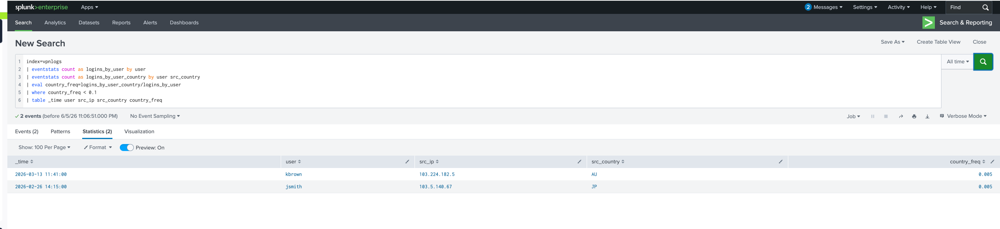
*2 flagged records — user `jsmith` with src_ip 183.224.142.5 from **JP** (Japan, country_freq: 0.001) and src_ip 183.3.148.47 also from JP — jsmith essentially never logs in from Japan, making these logins statistically anomalous*

**Answer:** Outlier user = **jsmith**  
**Answer:** Anomalous country = **JP (Japan)**

> **What makes this detection production-ready:** The `country_freq` metric is self-calibrating — it adapts to each user's own baseline, not a global threshold. A user who frequently travels internationally will have higher `country_freq` values for many countries and won't be flagged. A user who always logs in from the US shows near-zero frequency for Japan — making that login an immediate high-confidence alert.

---

## Key Findings Summary

| Question | Query / Method | Answer |
|----------|---------------|--------|
| Total events in `index=windowslogs` | Basic search, no filters | **12,256** |
| Most active SourceIP | SourceIp field popup — top values | **172.90.12.11** |
| Events in time window (Apr 15, 08:05–08:06) | Custom time range picker applied | **594** |
| EventID=1 (Process Create) count | `stats count by EventID \| sort EventID` | **26** |
| DestinationIp=172.18.39.6 + Port=135 events | Field conditions filter | **4** |
| Top SourceIp for Hostname=Salena.Adam | Field conditions + SourceIp popup | **172.90.12.11** |
| Wildcard `cyber*` event count | Wildcard search | **12,256** |
| Lowest priority boolean operator | SPL precedence rules | **OR** |
| Highest SourceProcessId via `fields` | `fields` command + field popup | **9,496** |
| First AccountName in `table` output | `\| table EventID AccountName AccountType` | **SYSTEM** |
| Password for user Alberto | `EventID=1 \| table CommandLine \| reverse` | **paW4rd!** |
| Most executed process (`top Image`) | `\| top Image` | **C:\Windows\System32\svchost.exe** |
| Geographic region of source IPs | `\| iplocation SourceIp` | **California** |
| Highest RiskScore Image | `\| lookup image_riskScore` | **powershell.exe (score: 10)** |
| VPN outlier user | Country frequency anomaly detection | **jsmith** |
| Anomalous login country | VPN country frequency analysis | **JP (Japan)** |

---

## SPL Command Reference

| Command | Purpose | Example |
|---------|---------|---------|
| `fields` | Keep or drop specific fields in pipeline | `\| fields EventID AccountName -_raw` |
| `table` | Display as formatted columns | `\| table _time EventID User Image` |
| `top` | Top N values by frequency with % | `\| top limit=10 Image` |
| `stats` | Aggregate with functions | `\| stats count by EventID` |
| `sort` | Order results ascending/descending | `\| sort -count` |
| `reverse` | Flip result order oldest-first | `\| reverse` |
| `regex` | Filter by regular expression pattern | `\| regex TargetObject="Manager$"` |
| `eval` | Create or transform fields | `\| eval hour=strftime(_time,"%H")` |
| `highlight` | Color-code terms in raw events | `\| highlight User EventID Image` |
| `chart` | Visualization-ready aggregation | `\| chart count by User` |
| `timechart` | Time-bucketed visualization | `\| timechart span=1hr count by Image` |
| `iplocation` | GeoIP enrichment from IP field | `\| iplocation SourceIp` |
| `lookup` | Join with external reference table | `\| lookup image_riskScore Image OUTPUT RiskScore` |
| `anomalydetection` | Statistical outlier detection | `\| anomalydetection` |

---

## What I Learned

**1. SPL is a pipeline language — order determines what each command sees.** Every `|` passes transformed data downstream. A `stats` command collapses 12,256 events into a summary table — any command after it works on that summary, not the original events. Getting this mental model right is the foundation of effective SPL writing.

**2. The Fields sidebar is an investigation accelerator.** After every query, the sidebar shows the top 10 values for every extracted field with counts. In a live investigation, clicking a field value adds it as a filter instantly. The SourceIp analysis and Salena.Adam compound query were both done this way — no typing required to pivot.

**3. Time scoping is non-negotiable in production.** An unscoped `index=windowslogs` query on a real deployment with billions of events would timeout. The time picker (or `earliest=`/`latest=` in the query) is the first thing set in any real investigation.

**4. Command-line logging (Sysmon EventID=1) is critical for forensics.** The Alberto password (`paW4rd!`) was only visible because Sysmon captured the full command line of every `net.exe` execution. Without it, the account creation is silent — the attacker leaves no trace.

**5. Risk scoring changes how you triage at scale.** Rather than alerting on every PowerShell execution (noise), the `image_riskScore` lookup assigns a weight to each process. Combine risk scoring with behavioral baselines and you get a system that escalates only when multiple risk signals accumulate — dramatically reducing alert fatigue.

**6. Statistical anomaly detection is self-calibrating.** The VPN `country_freq` pattern adapts to each user's individual baseline rather than using a global threshold. This means frequent travelers won't be falsely flagged while a single anomalous login from an unexpected country surfaces immediately.

---

## References

- [Splunk SPL Documentation](https://docs.splunk.com/Documentation/Splunk/latest/SearchReference/Whatsinthismanual)
- [Sysmon Event ID Reference](https://learn.microsoft.com/en-us/sysinternals/downloads/sysmon)
- [Windows Security Event IDs](https://www.ultimatewindowssecurity.com/securitylog/encyclopedia/)
- [Next in Series → SOC Dashboards & Alerting](../02-SOC-Dashboards-Alerting/) *(coming soon)*

---

*Part of the [Splunk Security Monitoring](../) series by [Yamini Savalia](https://cybermini.com)*
