# 02 — Splunk SOC Lab: Installation, Log Ingestion, Dashboards & Alerting

> **Series:** Splunk Security Monitoring  
> **Type:** Hands-on Lab · Infrastructure Setup + Feature Exploration  
> **Rooms:** Splunk Lab + Splunk Dashboards & Reports (TryHackMe)  
> **Platform:** Ubuntu Linux (VM), Splunk Enterprise + Universal Forwarder  
> **Completed:** June 8–9, 2026  
> **Author:** [Yamini Savalia](https://www.linkedin.com/in/yamini-savalia-387ab6100/)

---

## Overview

A two-part lab that covers the full operational lifecycle of a Splunk SOC environment: building the infrastructure from scratch (installation, forwarding, indexing) and then using that environment to build operational SOC capabilities (reports, searches, dashboards, and real-time alerting).

**Part 1** covers standing up Splunk Enterprise and the Universal Forwarder on a Linux host, configuring log forwarding, creating custom indexes, and ingesting real system and web server logs.

**Part 2** covers the analyst-facing layer: building and scheduling reports, running detection queries against web traffic data, creating dashboards with visualizations, and setting up real-time email alerts triggered by suspicious activity patterns.

---

## Architecture

```
[ Ubuntu VM: coffely ]
        |
        ├── /opt/splunk/            ← Splunk Enterprise (Search Head + Indexer)
        │       └── :8000           ← Web UI
        │       └── :9997           ← Receiving port for forwarder data
        │
        └── /opt/splunkforwarder/   ← Universal Forwarder
                └── monitors:
                        /var/log/syslog         → index: linux_host
                        /var/log/auth.log        → index: linux_host
                        /var/log/apache2/access.log → index: web
```

---

## Part 1 — Lab Setup: Installation & Log Ingestion

---

### 1. Installing Splunk Enterprise

Splunk Enterprise is downloaded as a `.tgz` archive and extracted to `/opt`. No package manager or repository is required — the tarball contains everything.

```bash
cd ~/Downloads/splunk
sudo su
tar xvzf splunk_installer.tgz -C /opt
```

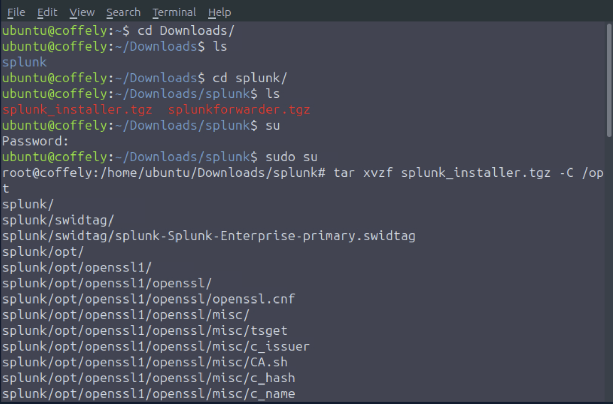
*Downloading and extracting `splunk_installer.tgz` alongside `splunkforwarder.tgz` — both packages present in `~/Downloads/splunk/` before installation begins*

After extraction, Splunk lands at `/opt/splunk`. Starting it for the first time triggers the admin account creation wizard.

```bash
/opt/splunk/bin/./splunk start --accept-license
```

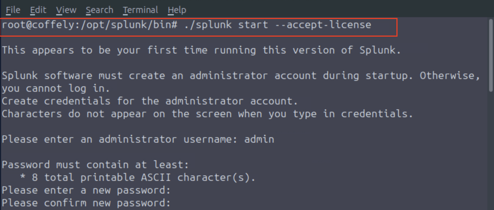
*First-time start — Splunk creates the administrator account during initial launch. Username set to `admin`, password configured at this step*

---

### 2. Accessing the Web Interface

Once started, the Splunk web UI is available at `http://127.0.0.1:8000`. The login page prompts for the credentials set during installation.

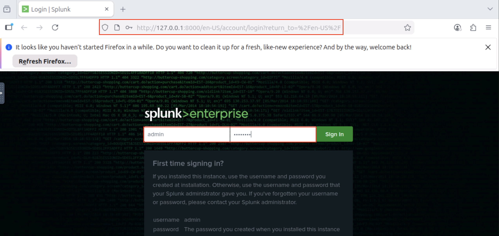
*Firefox accessing `http://127.0.0.1:8000` — Splunk Enterprise login page with `admin` username. Background shows sample log data that Splunk uses for its landing page*

---

### 3. Splunk CLI — Core Commands

Splunk ships with a command-line interface that mirrors most web UI operations. The CLI is essential for automation, scripting, and environments without browser access.

```bash
./splunk start          # Start the Splunk daemon
./splunk status         # Check daemon PID and helper process status
./splunk search <term>  # Run a search from the terminal
./splunk help           # List all available CLI subcommands
```

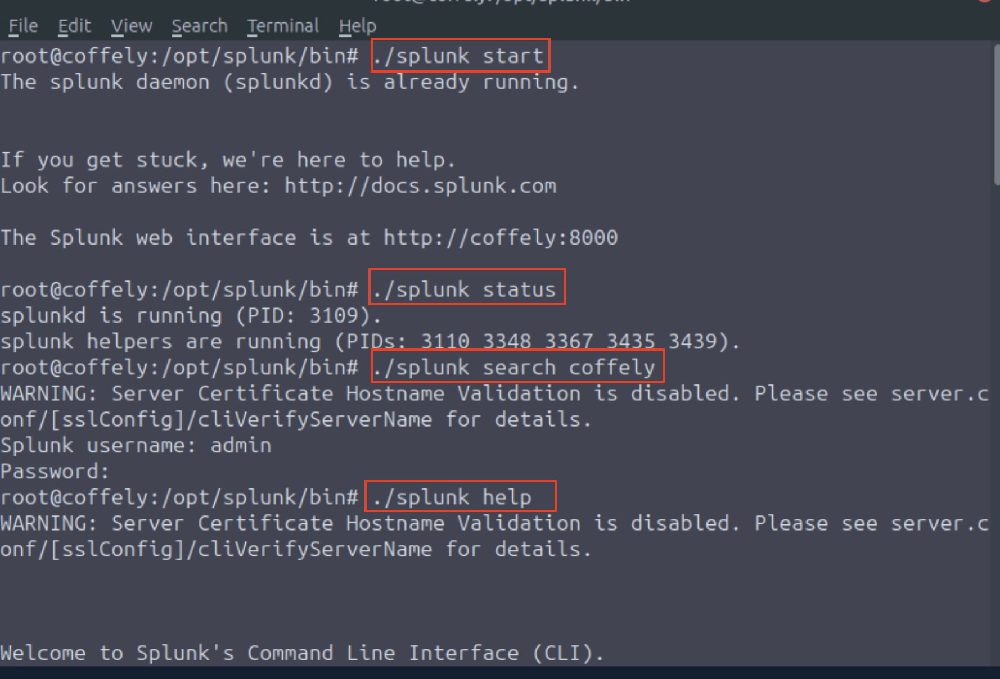
*CLI output showing: `./splunk start` (daemon already running), `./splunk status` (PID 3109, helper PIDs 3110 3348 3367 3435 3439), `./splunk search coffely` (credential prompt), and `./splunk help` (opens CLI reference)*

> The `./splunk search` command from the CLI is particularly useful in incident response — it lets you run queries and pipe the output to other tools without needing browser access.

---

### 4. Installing the Universal Forwarder

The Universal Forwarder (UF) is a lightweight agent that collects logs from endpoints and ships them to the Splunk indexer. It runs separately from Splunk Enterprise and has minimal footprint — no search capabilities, just data collection and forwarding.

```bash
tar xvzf splunkforwarder.tgz -C /opt
/opt/splunkforwarder/bin/./splunk start --accept-license
```

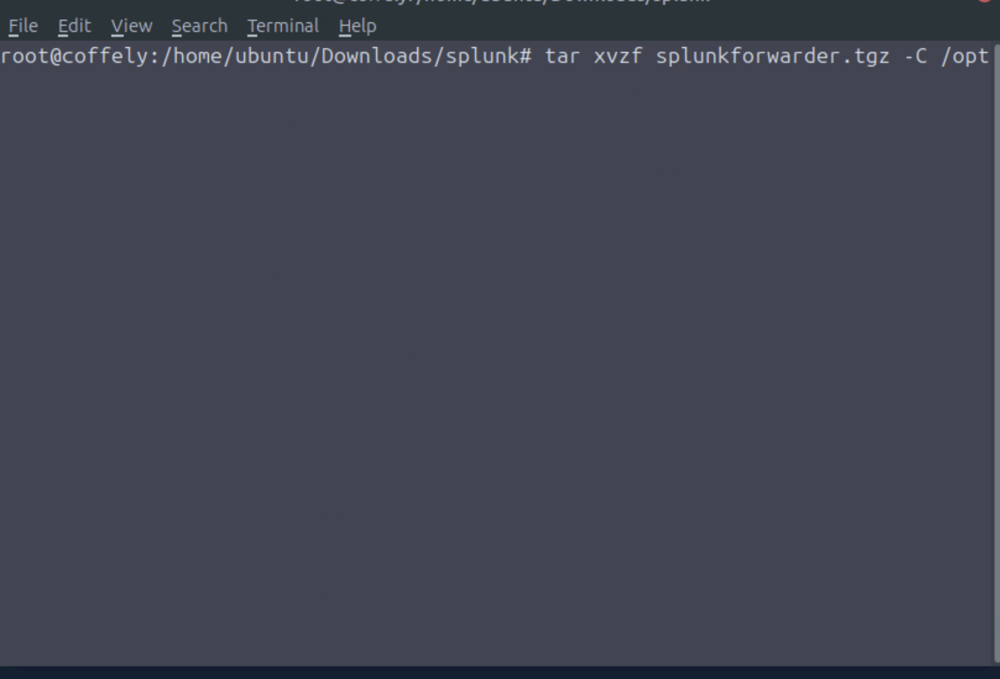
*Extracting `splunkforwarder.tgz` to `/opt` — the forwarder installs as `/opt/splunkforwarder/`, completely separate from the main Splunk installation*

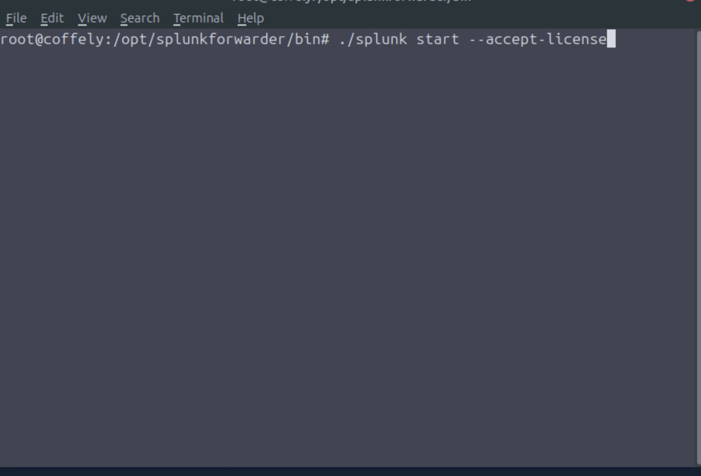
*Starting the Universal Forwarder with `--accept-license` — the forwarder runs as a background daemon, ready to be configured with monitors and a forwarding target*

---

### 5. Configuring Forwarding and Receiving

For the forwarder to deliver logs to Splunk Enterprise, two things must be configured:
1. **Indexer side:** Open a receiving port to accept incoming forwarder connections
2. **Forwarder side:** Point the forwarder to the indexer's IP and receiving port

#### Step 1 — Open a Receiving Port on the Indexer

Navigate to **Settings → Forwarding and receiving → Receive data → + Add new**.

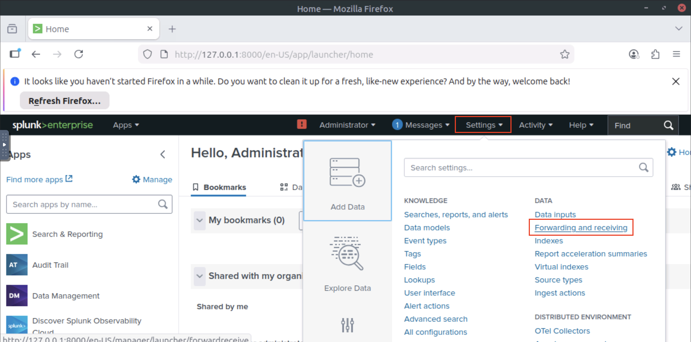
*Settings menu dropdown — `Forwarding and receiving` link highlighted under the DATA section. This is the entry point for all forwarder communication configuration*

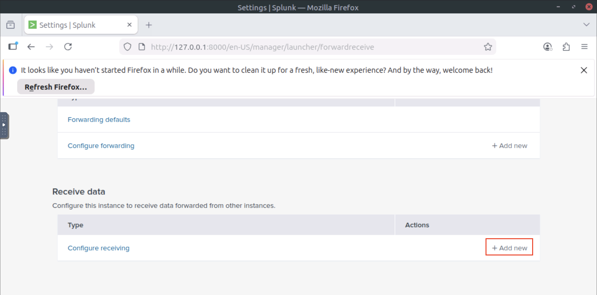
*Forwarding and receiving → Receive data — the `+ Add new` button opens the port configuration form*

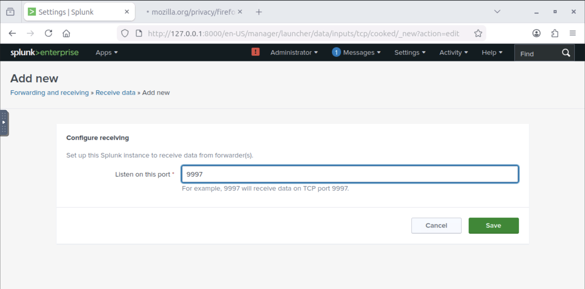
*Configure receiving: port `9997` entered — this is the standard Splunk receiving port. Splunk Enterprise will now listen on TCP 9997 for incoming forwarder connections*

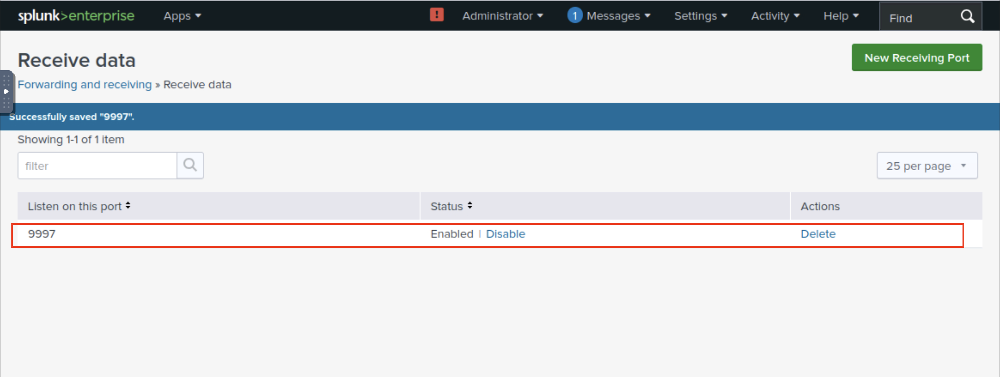
*"Successfully saved '9997'" — port 9997 is now Enabled. The indexer is ready to receive forwarded data*

#### Step 2 — Point the Forwarder to the Indexer

From the forwarder host, add the indexer as a forwarding target:

```bash
/opt/splunkforwarder/bin/./splunk add forward-server 10.146.191.221:9997
```

This tells the forwarder to send all collected logs to the indexer at that IP on port 9997.

---

### 6. Creating Custom Indexes

Indexes in Splunk are isolated storage buckets for different data types. Separating log sources into dedicated indexes improves search performance, simplifies access control, and makes retention policies easier to manage.

Navigate to **Settings → Indexes → New Index**.

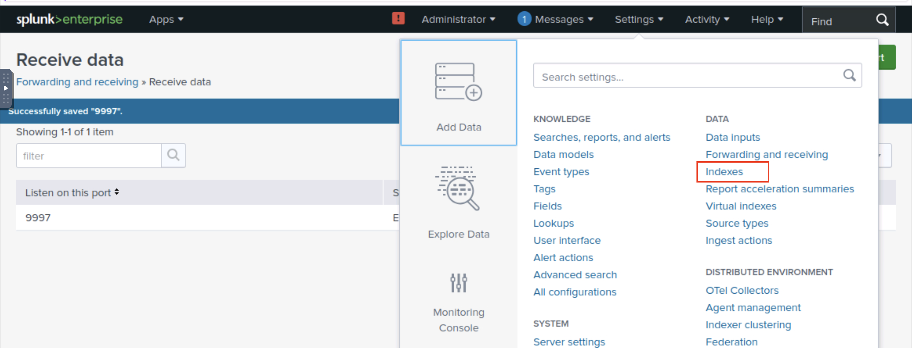
*Settings menu with `Indexes` highlighted under DATA — clicking this opens the index management page*

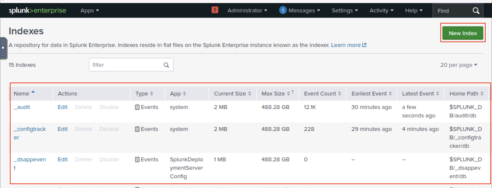
*Indexes page showing 15 existing indexes — `_audit`, `_configtracker`, `_dsappevent` (system indexes visible). `New Index` button in top right creates a custom index*

#### Creating the `linux_host` Index

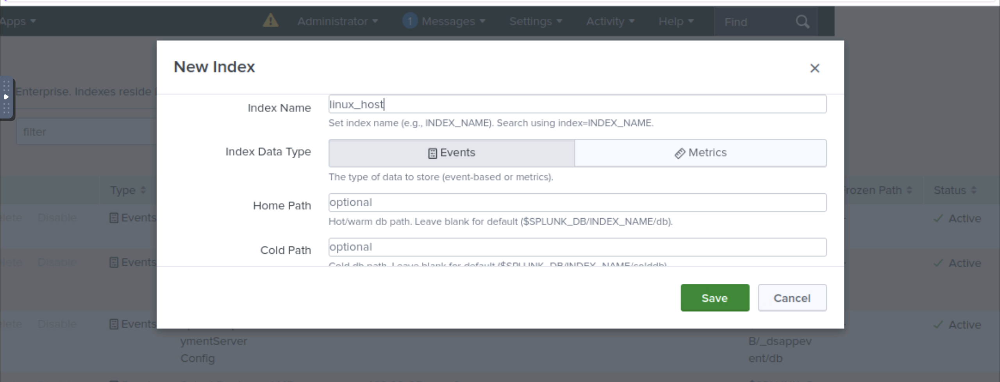
*New Index dialog with Index Name = `linux_host`, Data Type = Events — all Linux system logs (syslog, auth) will be directed to this index. Home Path and Cold Path left as defaults*

---

### 7. Configuring the Forwarder to Monitor System Logs

With the `linux_host` index created, the Universal Forwarder is configured to collect `/var/log/syslog` and forward it to that index.

```bash
# Add the monitor (correct syntax — space between path and flags)
/opt/splunkforwarder/bin/./splunk add monitor /var/log/syslog -index linux_host

# Verify the configuration was written
cat /opt/splunkforwarder/etc/apps/search/local/inputs.conf
```

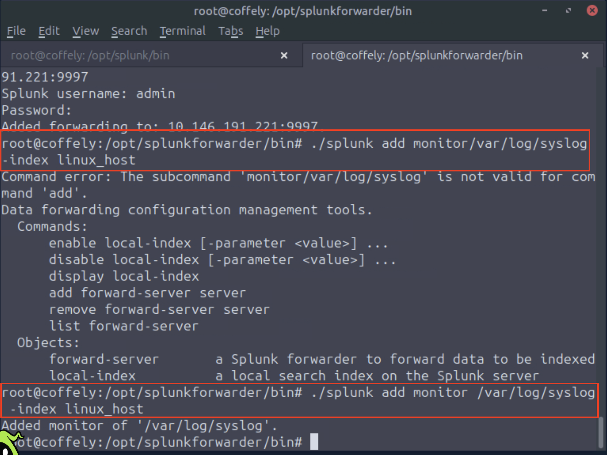
*Two-terminal view showing the monitor command being added. First attempt used wrong syntax (`monitor/var/log/syslog` as one word — error shown). Corrected command with space: `./splunk add monitor /var/log/syslog -index linux_host` → "Added monitor of '/var/log/syslog'"*

After adding the monitor, `inputs.conf` confirms the configuration:

```ini
[monitor:///var/log/syslog]
disabled = false
index = linux_host
```

Testing that the forwarder is capturing live events:

```bash
# Write a test log entry
logger "splunk-learning-is -going-well"

# Confirm it appears in syslog
tail -1 /var/log/syslog
# → 2026-06-09T18:56:47.144483+00:00 coffely root: splunk-learning-is -going-well
```

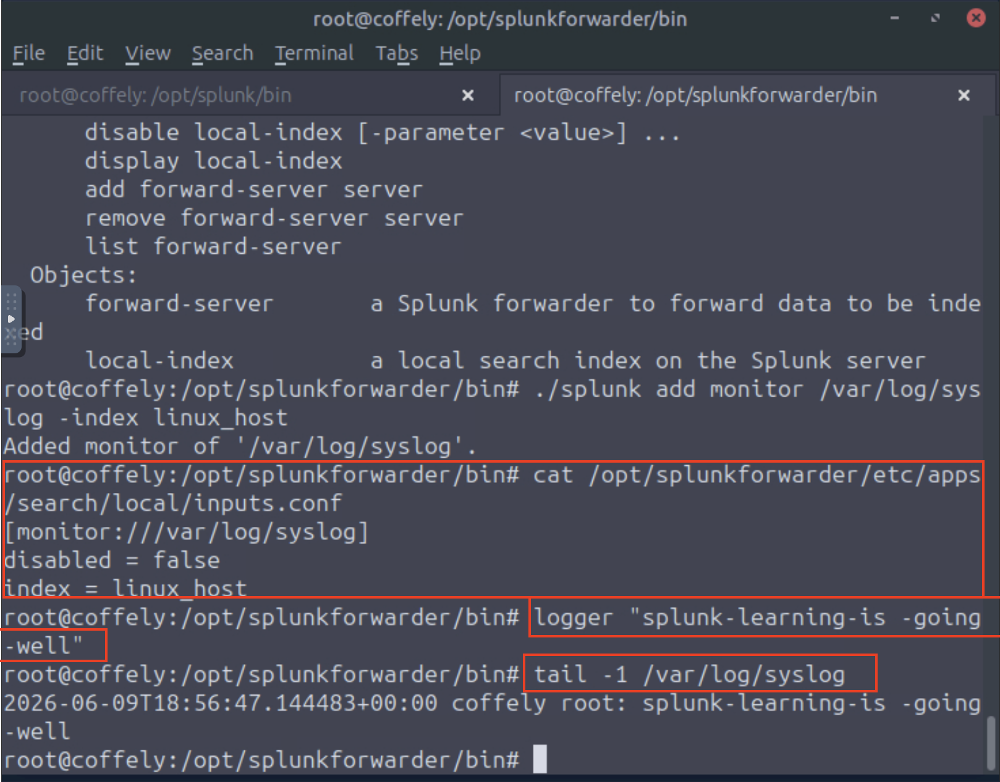
*`inputs.conf` contents confirming monitor is active. `logger` command writes a custom syslog entry. `tail -1 /var/log/syslog` confirms the entry is written and will be picked up by the forwarder*

---

### 8. Verifying Log Ingestion in Splunk

#### Syslog events

```spl
index=* linux_host "learning"
```

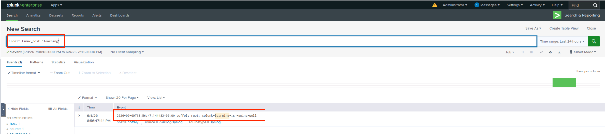
*1 event returned — the test log entry `splunk-learning-is -going-well` appears in Splunk, confirming the full forwarding pipeline is working: syslog → forwarder → indexer → `linux_host` index → searchable*

#### Auth log events

```spl
index=* linux_host auth
```

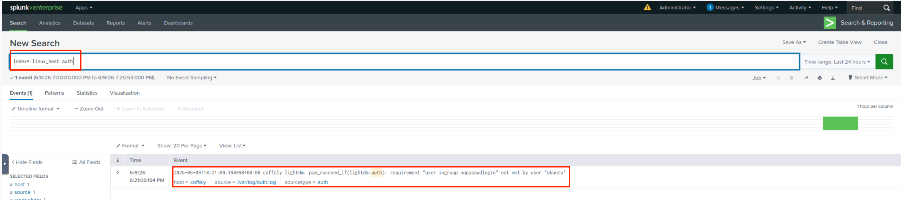
*PAM authentication event from `/var/log/auth.log` — "pam_succeed_if(lightdm:auth): requirement 'user ingroup nopasswdlogin' not met by user 'ubuntu'". Authentication logs are flowing into the linux_host index alongside syslog*

#### User creation events

```spl
index=* linux_host adduser
```

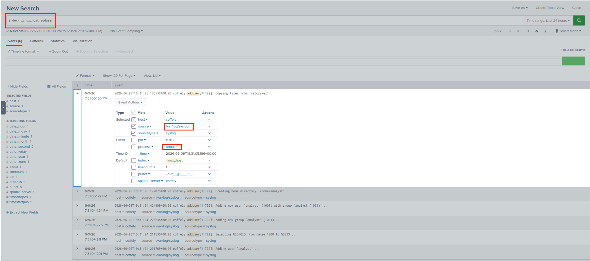
*6 events from `useradd` — "Adding new user 'analyst' (1001)", "Adding new group 'analyst' (1001)", "Creating home directory /home/analyst". System administration actions are being captured — this type of event is critical for detecting unauthorized account creation in a real SOC*

---

### 9. Adding Apache Web Server Logs

Apache access logs (`/var/log/apache2/access.log`) are ingested using Splunk's **Add Data** wizard, which auto-detects the source type and creates a new index.

Navigate to **Settings → Add Data → Monitor → File & Directory**.

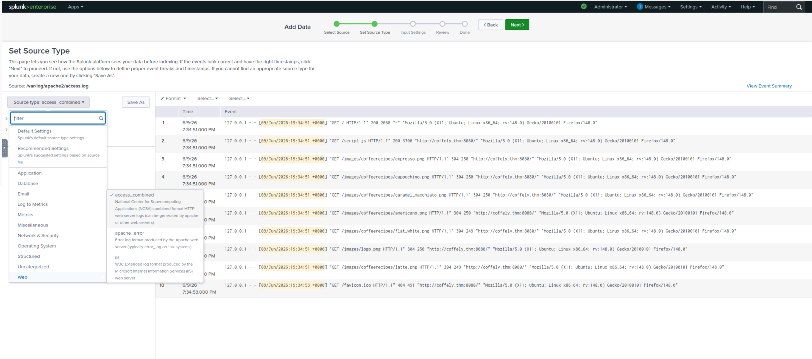
*Add Data wizard — Set Source Type step. Source: `/var/log/apache2/access.log`. Splunk automatically detects `access_combined` (Apache Combined Log Format) from the log structure. Events visible in preview — GET requests with status codes, user agents, byte counts*

#### Creating the `web` Index

Before completing the wizard, a dedicated `web` index is created for this data:

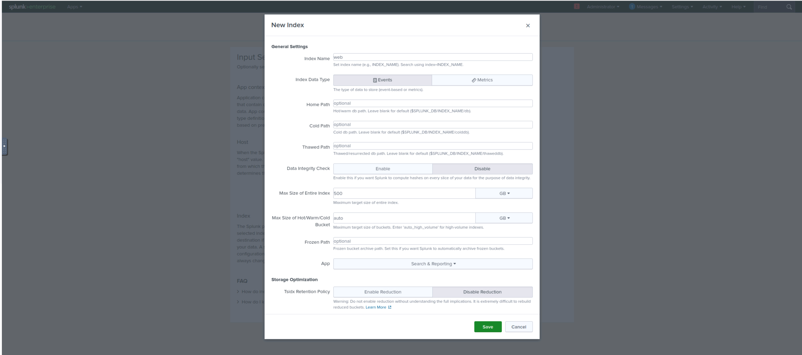
*New Index dialog — Index Name: `web`, Data Type: Events. Max Size: 500 GB. This separates Apache web logs from the Linux system logs in `linux_host`*

#### Final Review and Confirmation

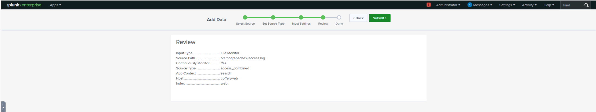
*Add Data Review step confirming all settings: Input Type: File Monitor, Source Path: `/var/log/apache2/access.log`, Continuously Monitor: Yes, Source Type: `access_combined`, Host: `coffelyweb`, Index: `web`*

After submitting, Apache logs are immediately searchable:

```spl
source="/var/log/apache2/access.log" host="coffelyweb" index="web" sourcetype="access_combined"
```

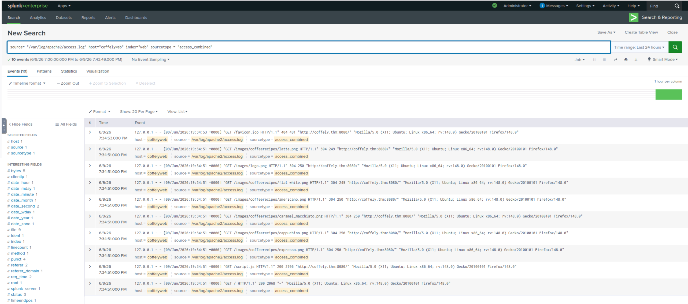
*90 events returned — Apache access log entries with full parsed fields (IP, timestamp, method, URI, status code, bytes, user agent). Selected fields on left show `bytes 5`, `clientip 3`, `referer_domain 1`, `status 3`, `timempos 1`*

---

## Part 2 — SOC Features: Reports, Detection Queries, Dashboards & Alerts

---

### 10. Exploring Built-in Reports

Splunk Search & Reporting ships with 7 pre-built reports covering common operational scenarios. These serve as starting templates for building custom SOC reports.

Navigate to **Search & Reporting → Reports tab**.

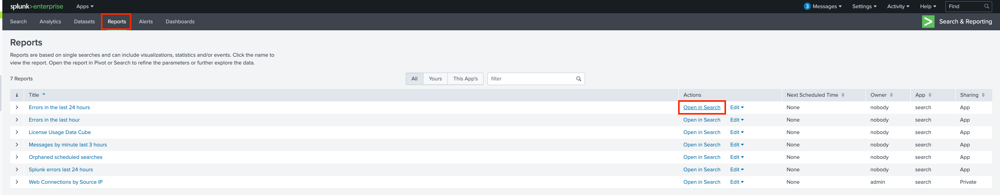
*7 built-in reports: "Errors in the last 24 hours", "Errors in the last hour", "License Usage Data Cube", "Messages by minute last 3 hours", "Orphaned scheduled searches", "Splunk errors last 24 hours", "Web Connections by Source IP" — each has Open in Search, Edit, and scheduling controls*

Opening "Errors in the last 24 hours" shows the search behind it:

```spl
error OR failed OR severe OR (sourcetype=access_* (404 OR 500 OR 503))
```

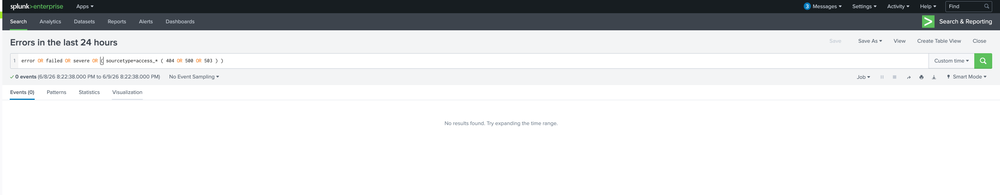
*"Errors in the last 24 hours" report — 0 events returned for the current time range. The query filters for error-level terms across all sourcetypes, including HTTP 4xx/5xx from access logs*

---

### 11. Building a VPN Logins by Username Report

A custom report is created to track VPN authentication activity by user — a standard SOC metric for detecting credential sharing, account takeover, or impossible travel.

**Query:**
```spl
index = vpn_server
| stats count by Username
| sort - count
```

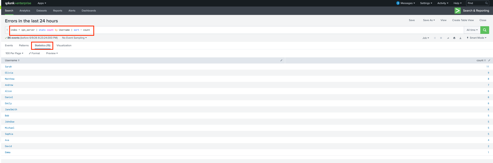
*81 events processed — Statistics tab shows username ranking by login count: Sarah (11), Olivia (9), Matthew (9), Andrew (8), Alice (8), Daniel (8), Emily (8), JaneSmith (8), Bob (8), JohnDoe (8), Michael (8), Sophia (8), Ava (4), David (4)...*

> **SOC use case:** Sorting VPN logins by frequency surfaces two types of risk: users at the top (high volume — possible credential stuffing or shared accounts) and users who appear rarely (low frequency from unexpected geography — possible account takeover).

---

### 12. Scheduling the VPN Report

Reports can be scheduled to run automatically and alert when conditions change. This turns a one-time query into a persistent SOC monitoring capability.

Navigate to **Edit → Edit Schedule** on the VPN Logins report.

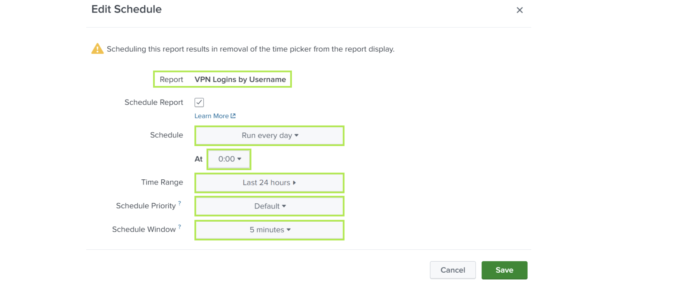
*Edit Schedule dialog for "VPN Logins by Username" — Schedule: Run every day at 0:00, Time Range: Last 24 hours, Schedule Priority: Default, Schedule Window: 5 minutes. Enabling this checkbox removes the time picker from the report display and activates automated execution*

---

### 13. Analyzing Web Traffic — URI Activity

With `web_logs` indexed, the investigation pivots to web traffic patterns. The URI field shows what resources users are requesting.

```spl
index = "web_logs"
```

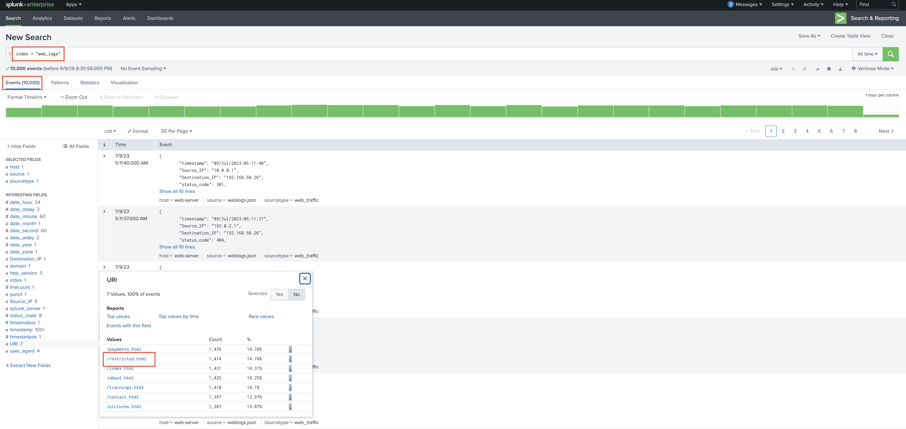
*90,000 events in `web_logs`. URI field popup showing top values: `/payments.html` (1,478, 14.70%), `/restricted.html` (1,476, 14.74%), `/index.html` (1,431, 14.27%), `/about.html` (1,421, 14.26%), `/trainings.html` (1,418, 14.1%), `/contact.html` (1,397, 13.97%), `/pictures.html` (1,397, 13.87%)*

`/restricted.html` appearing as the second-most accessed URI is immediately suspicious — a restricted resource should not be in the top 2 of all web traffic.

---

### 14. Detection Query — Unauthorized Access to Restricted URI

**Objective:** Find all requests to `/restricted.html` originating from outside the expected internal IP ranges.

**Query:**
```spl
index = web_logs URI = /restricted.html
NOT Source_IP IN (10.0.0.0/8, 172.16.0.0/12, 192.168.0.0/16)
NOT URI = "/restricted.html"
| top limit=20 URI
```

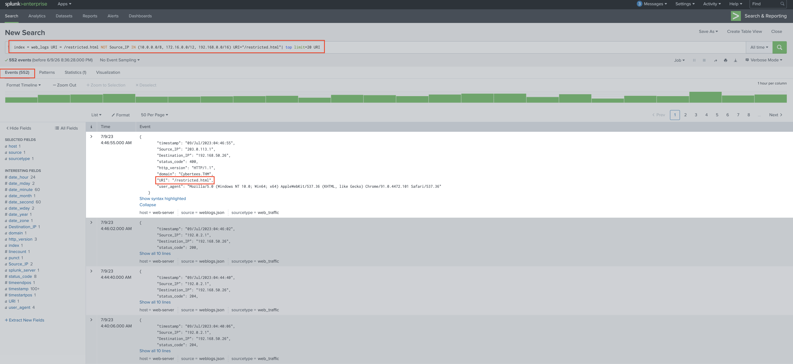
*552 events match — external IPs accessing `/restricted.html`. The `NOT Source_IP IN` clause filters out all RFC 1918 private address ranges, leaving only traffic from external/public IPs. Syntax highlighted to show the NOT operator filtering external addresses*

> **Why this matters:** `/restricted.html` by name implies it should not be publicly accessible. 552 hits from external IPs is a clear indicator of either a misconfigured access control or active reconnaissance/exploitation. This is the exact query pattern used in real SOC detection rules.

---

### 15. Exploring Status Codes on Target URIs

**Query:**
```spl
index = web_logs URI = /payments.html
```

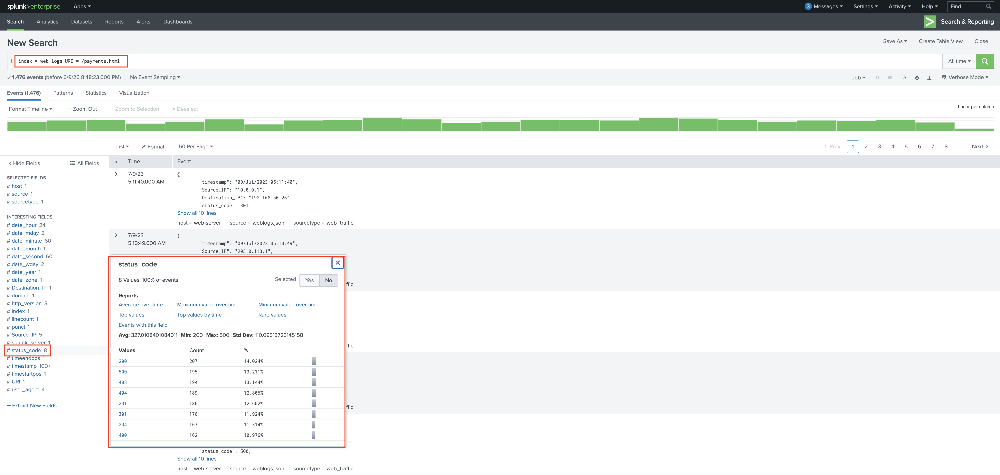
*1,476 events for `/payments.html`. status_code field popup: Avg 327, Max 500, Min 200, Std Dev 110. Top values include 200 (success), 301 (redirect), 403 (forbidden), 404 (not found), 408 (timeout), 503 — the distribution of status codes across a payments URI is a direct data quality and security signal*

---

### 16. 404 Spike Detection — Alert Logic

**Objective:** Detect abnormally high 404 counts per time window, which can indicate directory brute-forcing or broken link exploitation.

**Query:**
```spl
index = web_logs URI = /payments.html status_code = 404
| bin _time span=1d
| stats count as hits by _time
| where hits > 11
| eval alert = "HIGH 404s " + "is " + tostring(hits) + "% (Normal: -7.6/hr)"
```

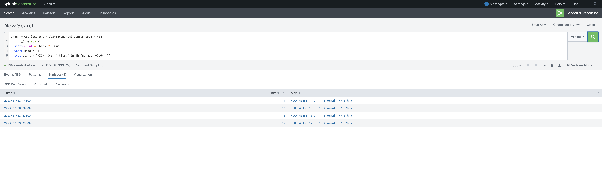
*Query results showing daily 404 hit counts exceeding the threshold: 14 hits (2023-07-08), 15 hits (2023-07-08 later), 18 hits (2023-07-08), 12 hits (2023-07-08). Each row triggers the alert string: "HIGH 404s is 14% (Normal: -7.6/hr)"*

---

## Part 2 — Dashboards & Alerting

---

### 17. Exploring the Dashboards Interface

Dashboards aggregate multiple searches into a single live view — the primary tool for SOC analysts monitoring multiple data streams simultaneously.

Navigate to **Search & Reporting → Dashboards tab**.

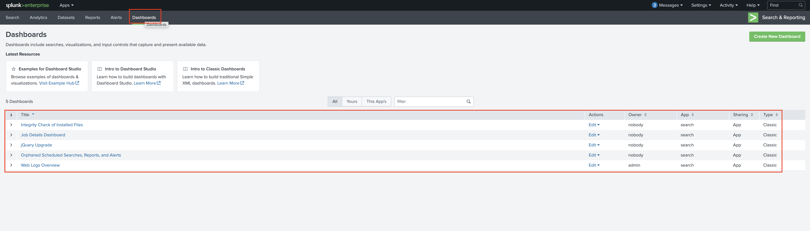
*5 existing dashboards: "Integrity Check of Installed Files", "Job Details Dashboard", "jQuery Upgrade", "Orphaned Scheduled Searches Reports and Alerts", "Web Logs Overview" — all are App-level Classic dashboards. `Create New Dashboard` button in top right*

---

### 18. Creating a New Dashboard

A new dashboard is created to visualize error log patterns for the web application.

Navigate to **Create New Dashboard**.

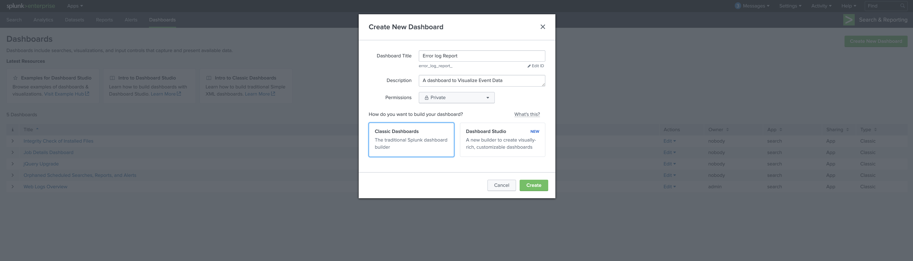
*Create New Dashboard dialog — Title: "Error log Report", ID: `error_log_report` (auto-generated), Description: "A dashboard to Visualize Event Data", Permissions: Private. "Classic Dashboards" selected (the traditional XML-based builder — gives full control over panel layout and SPL)*

---

### 19. Adding Panels — Pie Chart and Statistics Table

With the dashboard created, panels are added using the **Add Panel** menu. Each panel runs its own independent search.

**Panel 1 — URI Event Distribution (Pie Chart):**
```spl
index = web_logs URI = /restricted.html
| stats count by status_code
| eval percent = round((count / total) * 100, 2)
| sort - count
```

**Panel 2 — Status Code Table:**
Runs the same query in Statistics Table format to show raw numbers alongside the visual.

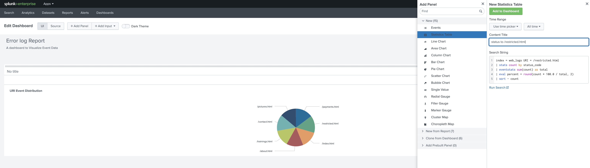
*Edit Dashboard view — "Add Panel" sidebar open with "New Statistics Table" selected. Search string for the status code analysis query visible. Content Title: "status to /restricted.html". Pie Chart panel already placed in the canvas showing URI distribution*

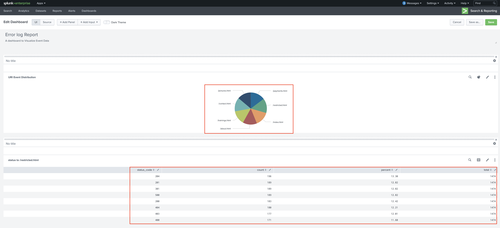
*Completed "Error log Report" dashboard with two panels: (1) "URI Event Distribution" — pie chart showing the breakdown of URI access patterns, (2) "status to /restricted.html" — statistics table with columns: status_code, count, percent, total. Status codes 284–408 with counts ~177–198 and percent ~11-14% visible*

---

### 20. Creating a Real-Time Alert

**Objective:** Automatically notify the SOC team when an external IP accesses `/restricted.html`.

Navigate to **Save As → Alert** from the detection search.

**Alert configuration:**

| Setting | Value |
|---------|-------|
| Title | Restricted URI Accessed by Outside IP |
| Alert Type | Real-time |
| Trigger | Per-Result (fires for each matching event) |
| Expires | 24 hours |
| Action | Send email to `soc@tryhackme.com` |
| Subject | Splunk Alert: Restricted URI Access |
| Message | A Source_IP outside of the expected range attempted to access /restricted.html |

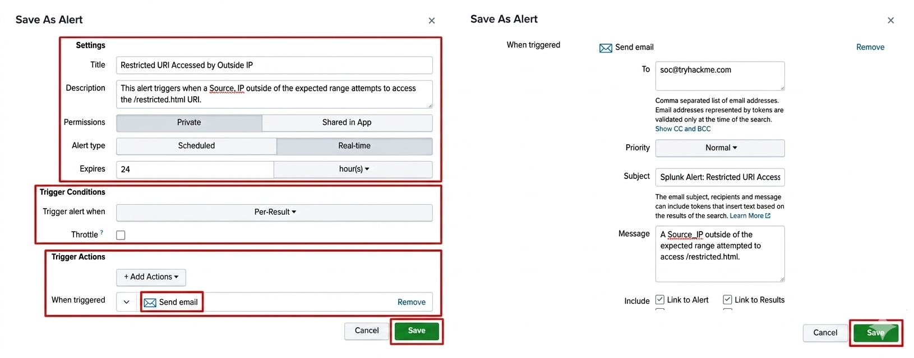
*Save As Alert configuration (two-panel view): Left — Settings showing title "Restricted URI Accessed by Outside IP", alert type Real-time, trigger Per-Result, Throttle unchecked, action Send email. Right — Email configuration with recipient `soc@tryhackme.com`, subject "Splunk Alert: Restricted URI Access", message body, and "Link to Alert" + "Link to Results" checkboxes enabled*

> **Why real-time Per-Result alerting:** A scheduled alert (runs every N minutes) would introduce detection lag — up to N minutes before the SOC sees the event. Per-Result real-time alerting fires immediately when the search condition matches a new event, minimizing response time. The trade-off is higher compute cost, so it should be reserved for high-severity conditions like unauthorized access to restricted resources.

---

## Summary

| Component | Configuration |
|-----------|--------------|
| Splunk Enterprise | Installed at `/opt/splunk`, web UI on port 8000 |
| Universal Forwarder | Installed at `/opt/splunkforwarder`, forwards to port 9997 |
| Receiving Port | 9997 (TCP) — enabled on indexer |
| Index: `linux_host` | Receives `/var/log/syslog` + `/var/log/auth.log` |
| Index: `web` | Receives `/var/log/apache2/access.log` (source type: `access_combined`) |
| VPN Report | `stats count by Username \| sort -count`, scheduled daily at midnight |
| Detection Query | External IPs accessing `/restricted.html` — 552 hits identified |
| Dashboard | "Error log Report" — pie chart + stats table for `/restricted.html` status codes |
| Real-Time Alert | Fires per-result, emails `soc@tryhackme.com` on each `/restricted.html` hit from external IP |

---

## Key Takeaways

**1. The forwarder–indexer model scales cleanly.** A single Universal Forwarder on each endpoint ships all local logs to a central indexer. Adding a new log source means one `splunk add monitor` command — no agent reconfiguration, no restart of the indexer. In a real enterprise, this pattern extends to thousands of endpoints.

**2. Indexes are the primary unit of access control and data management.** Separating `linux_host` from `web` logs means different teams can have different access levels, different retention policies, and different alert budgets — all without touching each other's data.

**3. SPL reports become institutional knowledge when scheduled.** A one-time query answers one question. A scheduled report that runs every day at midnight and emails results to a distribution list becomes part of the SOC's daily rhythm — surfacing changes automatically without analyst intervention.

**4. The `/restricted.html` pattern is a real-world detection.** Finding 552 hits from external IPs on a restricted resource in a real environment would immediately trigger an incident response workflow. The query pattern (`NOT Source_IP IN (RFC 1918 ranges)`) is production-ready as a scheduled search or real-time alert.

**5. Real-time alerting has a cost.** Per-Result real-time alerts are the most responsive but most compute-intensive alerting mode. In a production environment with high event volume, the right balance is: real-time for critical resources (like `/restricted.html`), scheduled for volume metrics (VPN logins, 404 spikes).

**6. Dashboards are the SOC analyst's workspace.** A well-designed dashboard eliminates context-switching — everything an analyst needs to triage a situation should be visible without running new searches. The "Error log Report" dashboard demonstrates the pattern: one visual (pie chart for quick shape recognition) + one table (raw numbers for accurate counts) per data dimension.

---

## References

- [Splunk Enterprise Installation Guide](https://docs.splunk.com/Documentation/Splunk/latest/Installation/Whatsinthismanual)
- [Universal Forwarder Manual](https://docs.splunk.com/Documentation/Forwarder/latest/Forwarder/Abouttheuniversalforwarder)
- [Splunk Dashboard Documentation](https://docs.splunk.com/Documentation/Splunk/latest/Viz/Aboutthismanual)
- [Splunk Alerting Manual](https://docs.splunk.com/Documentation/Splunk/latest/Alert/Aboutalerts)
- [Next in Series → Threat Detection with Splunk ES](../03-Threat-Detection-Splunk-ES/) *(coming soon)*

---

*Part of the [Splunk Security Monitoring](../) series by [Yamini Savalia](https://cybermini.com)*
