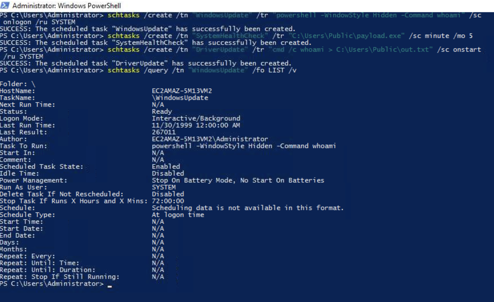
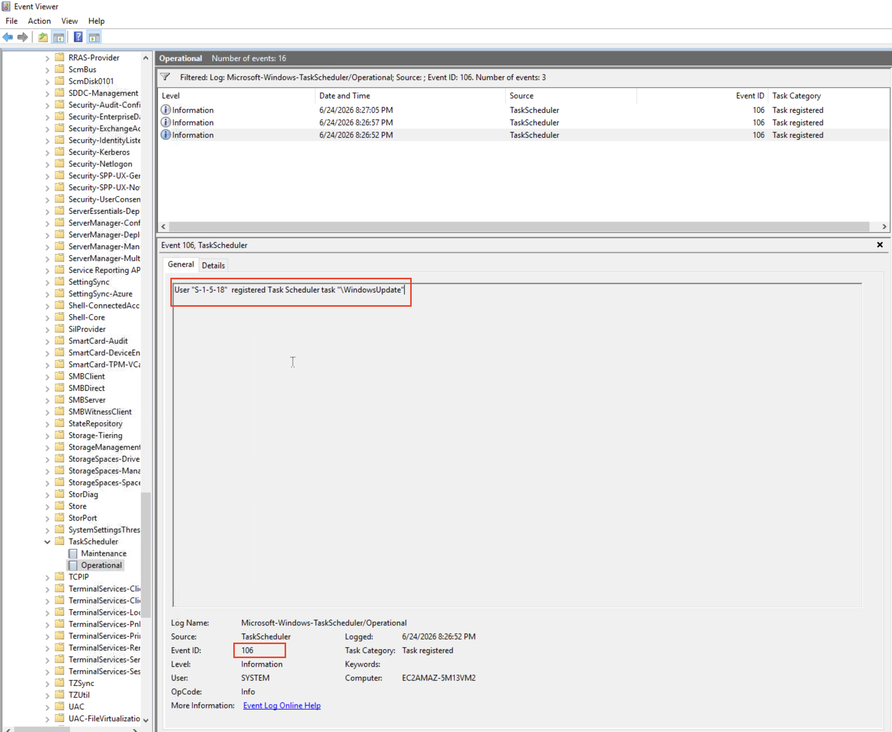
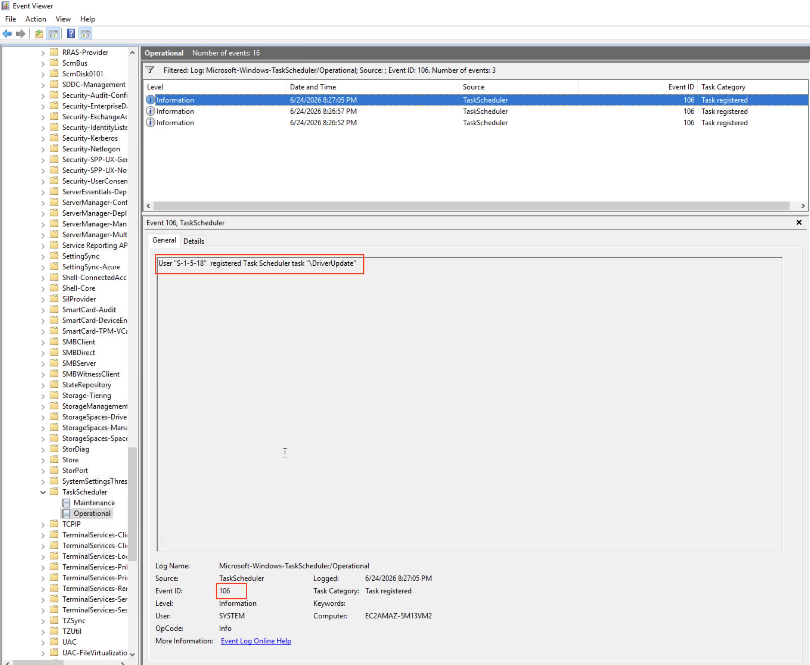
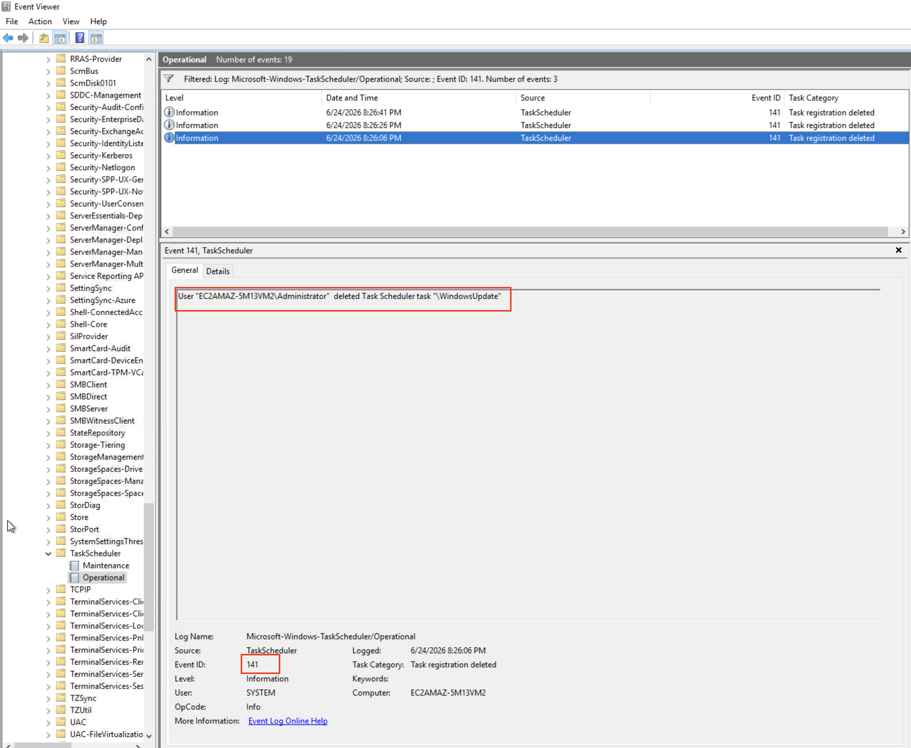
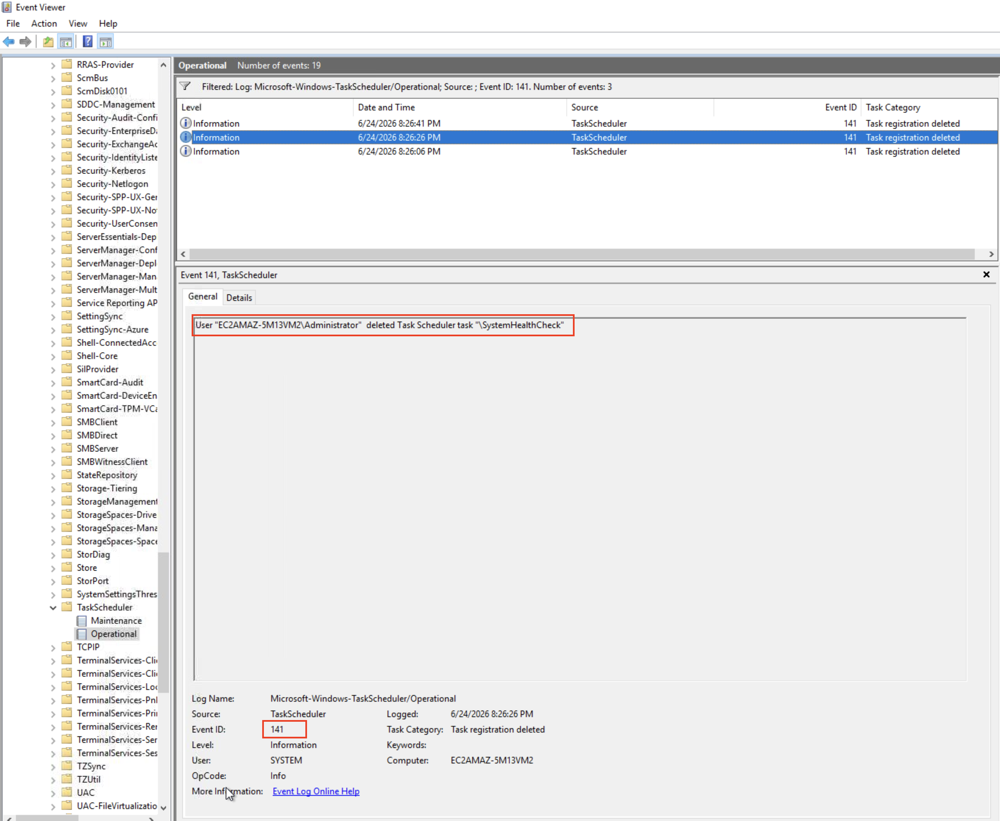
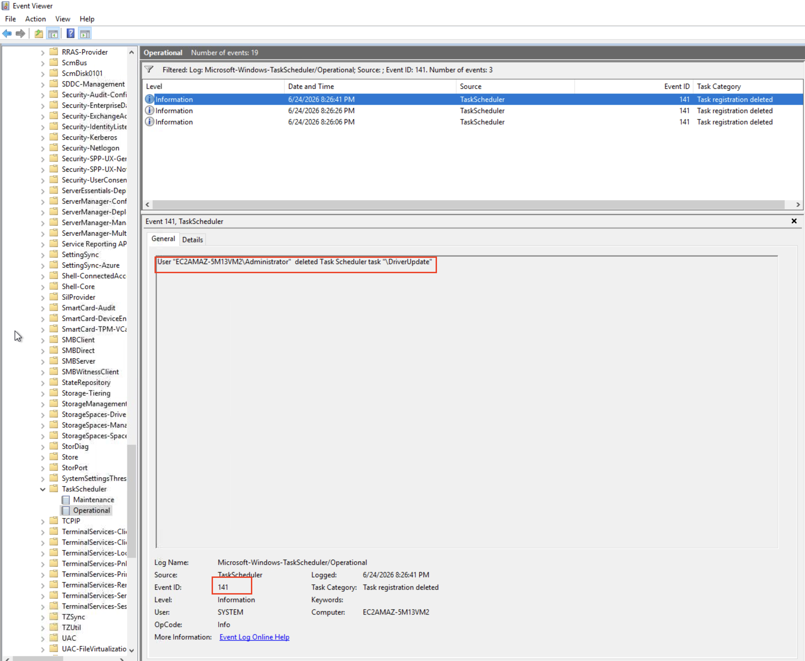

# Logs Observed — T1053.005 Scheduled Task Creation

**Lab Environment:** Windows Server (TryHackMe AttackBox)  
**Date:** 2026-06-24  
**Computer:** EC2AMAZ-5M13VM2  
**Setup:** Task Scheduler Operational log enabled via Event Viewer. Process creation auditing enabled. Sysmon not installed on this machine.

---

## Attack Commands Executed



Three scheduled tasks were created from an Administrator PowerShell session:

```cmd
schtasks /create /tn "WindowsUpdate" /tr "powershell -WindowStyle Hidden -Command whoami" /sc onlogon /ru SYSTEM
schtasks /create /tn "SystemHealthCheck" /tr "C:\Users\Public\payload.exe" /sc minute /mo 5
schtasks /create /tn "DriverUpdate" /tr "cmd /c whoami > C:\Users\Public\out.txt" /sc onstart /ru SYSTEM
```

Query output confirmed task details:
```
TaskName:     \WindowsUpdate
Task To Run:  powershell -WindowStyle Hidden -Command whoami
Run As User:  EC2AMAZ-5M13VM2\Administrator
Schedule:     At logon time
Status:       Ready
```

---

## Event ID 106 — Task Registered (Task Scheduler Operational)

**Log Path:** `Applications and Services Logs > Microsoft > Windows > TaskScheduler > Operational`  
**Total 106 events generated:** 3 (one per task created)

Event ID 106 fires immediately on every `schtasks /create` execution. It records the task name and the identity that registered it — exposing disguised task names and the creating user context.

### WindowsUpdate Task — Registered as SYSTEM

```
Event ID:       106
Task Category:  Task registered
Description:    User "S-1-5-18" registered Task Scheduler task "\WindowsUpdate"
User:           SYSTEM
Computer:       EC2AMAZ-5M13VM2
Date:           6/24/2026 6:26:52 PM
```



> Key observation: The task runs as SYSTEM (S-1-5-18) — giving it the highest privilege level on the machine without requiring user interaction.

---

### SystemHealthCheck Task — Registered by Administrator

```
Event ID:       106
Task Category:  Task registered
Description:    User "EC2AMAZ-5M13VM2\Administrator" registered Task Scheduler task "\SystemHealthCheck"
User:           SYSTEM
Computer:       EC2AMAZ-5M13VM2
Date:           6/24/2026 6:26:57 PM
```


---

### DriverUpdate Task — Registered as SYSTEM

```
Event ID:       106
Task Category:  Task registered
Description:    User "S-1-5-18" registered Task Scheduler task "\DriverUpdate"
User:           SYSTEM
Computer:       EC2AMAZ-5M13VM2
Date:           6/24/2026 6:27:05 PM
```



---

## Event ID 141 — Task Deleted (Task Scheduler Operational)

Event ID 141 fires on every `schtasks /delete` execution — useful for tracking attacker cleanup attempts. In ransomware scenarios, threat actors delete shadow copies and tasks in bulk during the impact phase.

### WindowsUpdate Task — Deleted

```
Event ID:       141
Task Category:  Task registration deleted
Description:    User "EC2AMAZ-5M13VM2\Administrator" deleted Task Scheduler task "\WindowsUpdate"
Computer:       EC2AMAZ-5M13VM2
Date:           6/24/2026 6:26:08 PM
```



---

### SystemHealthCheck Task — Deleted

```
Event ID:       141
Task Category:  Task registration deleted
Description:    User "EC2AMAZ-5M13VM2\Administrator" deleted Task Scheduler task "\SystemHealthCheck"
```



---

### DriverUpdate Task — Deleted

```
Event ID:       141
Task Category:  Task registration deleted
Description:    User "EC2AMAZ-5M13VM2\Administrator" deleted Task Scheduler task "\DriverUpdate"
```



---

## Summary — Log Coverage Matrix

| Attack Action | Event 106 | Event 141 |
|---|---|---|
| `schtasks /create /tn "WindowsUpdate"` | ✅ Captured | — |
| `schtasks /create /tn "SystemHealthCheck"` | ✅ Captured | — |
| `schtasks /create /tn "DriverUpdate"` | ✅ Captured | — |
| `schtasks /delete /tn "WindowsUpdate"` | — | ✅ Captured |
| `schtasks /delete /tn "SystemHealthCheck"` | — | ✅ Captured |
| `schtasks /delete /tn "DriverUpdate"` | — | ✅ Captured |

---

## Key Detection Takeaways

1. **Task names mean nothing** — Attackers deliberately name tasks after legitimate processes (`WindowsUpdate`, `SystemHealthCheck`). Detection must focus on the task action (what it runs), not the task name.
2. **SYSTEM-run tasks are high risk** — A task registered by a non-OS process running as SYSTEM (`S-1-5-18`) is a strong indicator of persistence.
3. **Payload path matters** — Tasks pointing to writable user directories (`C:\Users\Public\`, `C:\Temp\`) are suspicious. Legitimate Windows tasks run from `C:\Windows\System32\`.
4. **Event 141 catches cleanup** — Attackers deleting tasks after execution is still logged. Rapid create→execute→delete sequences are detectable via correlation.
5. **Correlate with 4688** — Pair Event 106 with a 4688 showing `schtasks.exe` command line to get full context of what was scheduled.
