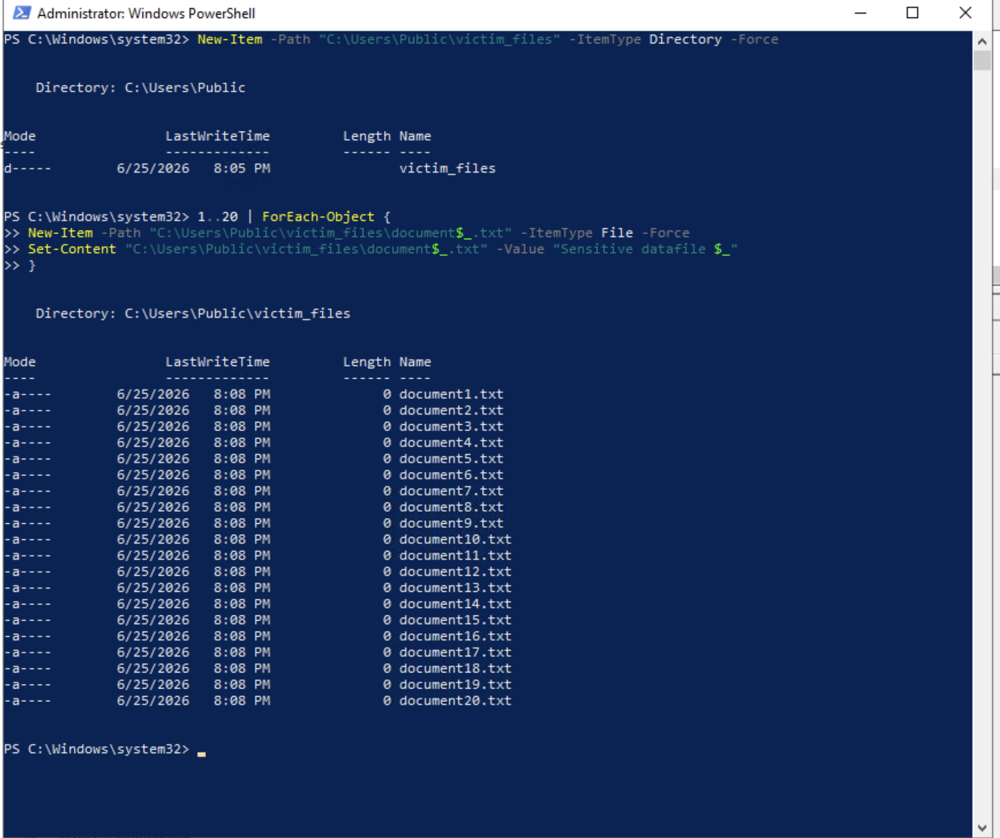
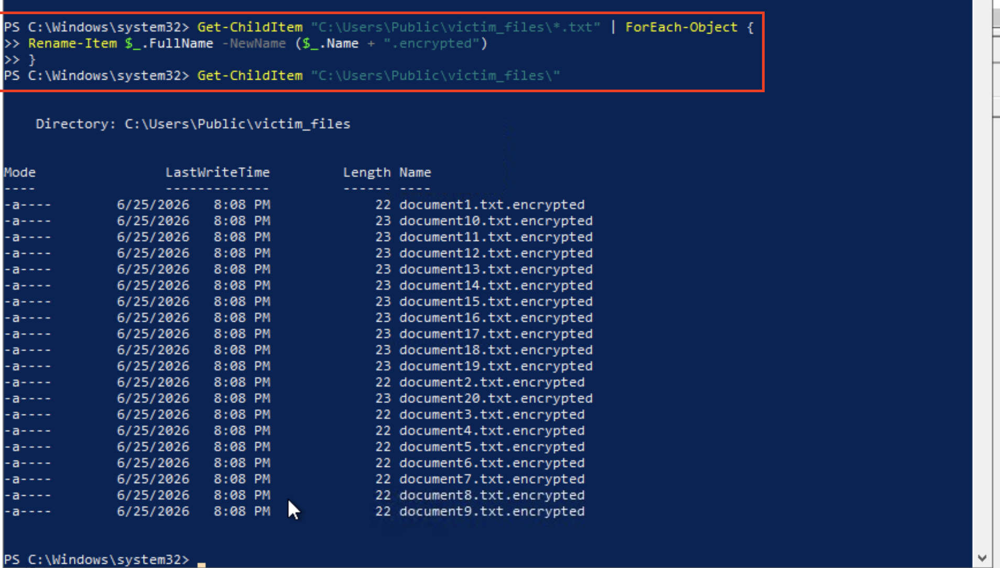
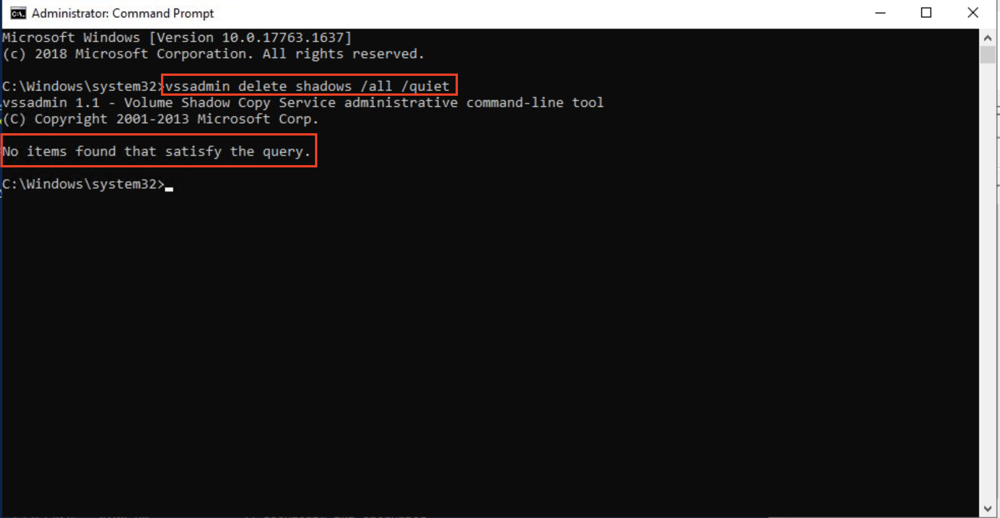
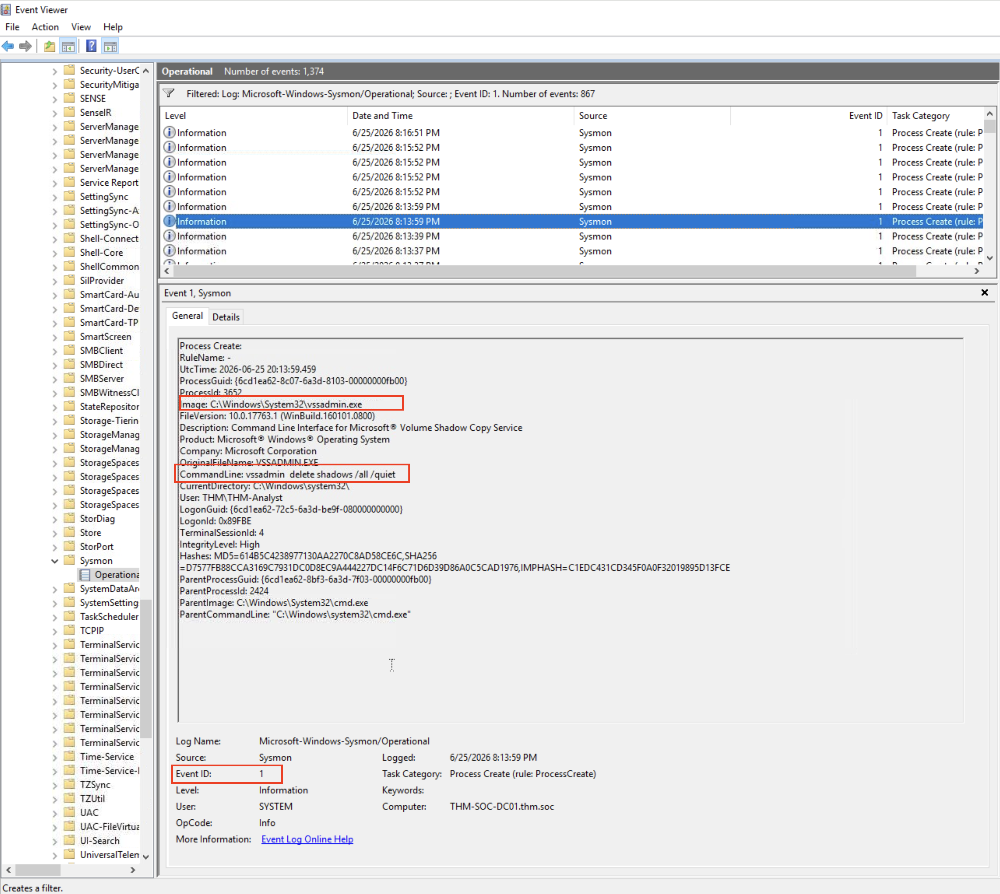
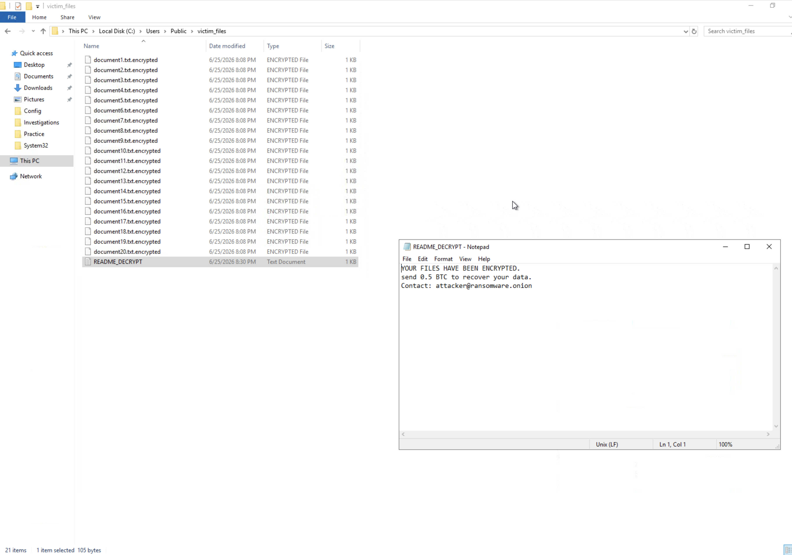

# Logs Observed — T1486 Data Encrypted for Impact (Ransomware Simulation)

**Lab Environment:** TryHackMe — Sysmon Room  
**Date:** 2026-06-25  
**Machine:** THM-SOC-DC01.thm.soc  
**User:** THM\THM-Analyst  

---

## Step 1 — Victim Files Created



20 victim documents created in `C:\Users\Public\victim_files\`:

```
document1.txt   document6.txt    document11.txt   document16.txt
document2.txt   document7.txt    document12.txt   document17.txt
document3.txt   document8.txt    document13.txt   document18.txt
document4.txt   document9.txt    document14.txt   document19.txt
document5.txt   document10.txt   document15.txt   document20.txt
```

All files created 6/25/2026 8:08 PM — simulating a directory of sensitive victim data.

---

## Step 2 — Mass File Encryption (Rename to .encrypted)



All 20 `.txt` files renamed to `.txt.encrypted` in a single loop operation:

```
document1.txt.encrypted    document11.txt.encrypted
document2.txt.encrypted    document12.txt.encrypted
document3.txt.encrypted    document13.txt.encrypted
...
document20.txt.encrypted
```

> This simulates ransomware's file encryption phase — in real attacks, content is encrypted before the extension change. The mass rename pattern (20+ files per second with uniform extension change) is the detection signal.

---

## Step 3 — Shadow Copy Deletion



```cmd
C:\Windows\system32> vssadmin delete shadows /all /quiet
vssadmin 1.1 - Volume Shadow Copy Service administrative tool
Copyright (C) 2001-2013 Microsoft Corp.

No items found that satisfy the query.
```

> No shadow copies existed on this lab machine — this output is common in virtualized environments. The command ran successfully and generated process creation logs. In production environments with shadow copies enabled, this command silently deletes all recovery points.

---

## Sysmon Event ID 1 — vssadmin Process Creation

**Log Path:** `Applications and Services Logs > Microsoft > Windows > Sysmon > Operational`

Sysmon Event ID 1 captured the full `vssadmin delete shadows` command — the most reliable single indicator of ransomware impact activity.

```
UtcTime:          6/25/2026 8:13:59 PM
ProcessGuid:      {6c4fee82-7c15-6a1d-ba0f-000000000000}
ProcessId:        2424
Image:            C:\Windows\System32\vssadmin.exe
CommandLine:      vssadmin delete shadows /all /quiet
User:             THM\THM-Analyst
LogonId:          0x5F8E
IntegrityLevel:   High
ParentImage:      C:\Windows\system32\cmd.exe
ParentCommandLine: C:\Windows\System32\cmd.exe
Computer:         THM-SOC-DC01.thm.soc
Event ID:         1
```



**Key detection fields:**
- `Image: vssadmin.exe` — shadow copy admin tool
- `CommandLine: vssadmin delete shadows /all /quiet` — full deletion with quiet flag
- `IntegrityLevel: High` — running with elevated privileges
- `ParentImage: cmd.exe` — launched from command prompt

---

## Final State — Encrypted Files + Ransom Note



`C:\Users\Public\victim_files\` final state:
- 20 `document*.txt.encrypted` files (ENCRYPTED FILE type, 1KB each)
- `README_DECRYPT.txt` ransom note (105 bytes)

Ransom note content:
```
YOUR FILES HAVE BEEN ENCRYPTED.
Send 0.5 BTC to recover your data.
Contact: attacker@ransomware.onion
```

---

## Sysmon Event ID 11 — File Creation (Detection Gap)

Sysmon Event ID 11 was **not captured** because the default Sysmon configuration does not include a FileCreate rule. To detect mass `.encrypted` file creation, add this to Sysmon config:

```xml
<FileCreate onmatch="include">
  <TargetFilename condition="contains">.encrypted</TargetFilename>
  <TargetFilename condition="contains">.locked</TargetFilename>
  <TargetFilename condition="contains">.ransom</TargetFilename>
</FileCreate>
```

When enabled, Event 11 would show:
```
EventID:        11
Image:          C:\Windows\System32\WindowsPowerShell\v1.0\powershell.exe
TargetFilename: C:\Users\Public\victim_files\document1.txt.encrypted
```

---

## Summary — Log Coverage Matrix

| Attack Action | Sysmon Event 1 | Sysmon Event 11 | 4688 |
|---|---|---|---|
| Victim files created | — | ⚠️ Needs config | — |
| Mass `.encrypted` rename | — | ⚠️ Needs config | — |
| `vssadmin delete shadows` | ✅ Captured | — | ⚠️ Needs audit policy |
| `README_DECRYPT.txt` created | — | ⚠️ Needs config | — |

---

## Key Detection Takeaways

1. **`vssadmin delete shadows` is the ransomware smoking gun** — present in Conti, LockBit, BlackCat, Ryuk, REvil. Any process executing this command on a workstation should alert at Critical severity immediately.
2. **Mass file extension changes in short time window** — 20+ files renamed with the same new extension within seconds is statistically impossible in normal business usage. Sysmon Event 11 with FileCreate rules catches this.
3. **Ransom note file names are detectable** — common names (`README_DECRYPT`, `HOW_TO_RESTORE`, `DECRYPT_INSTRUCTIONS`) can be monitored via Sysmon Event 11 on any path.
4. **Layer detections** — no single event tells the full story. Chain: mass file rename (Event 11) + vssadmin (Event 1) + ransom note drop (Event 11) = high-confidence ransomware detection before full encryption completes.
5. **wmic shadowcopy delete** is the alternative command — many ransomware families use both. Detection rules must cover both `vssadmin` and `wmic` variants.
